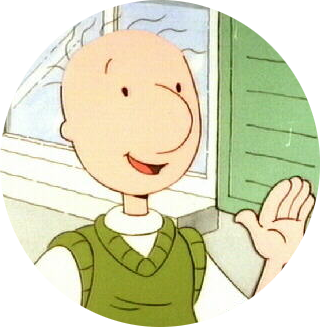

{ data-title="I Kinda Look Like This" data-description="Sorta." width="250px" align="right" }

My interests converged around enclosed 3D printing in 2019. I started with a used, clone-of-a-clone 3D printer and a willingness to learn and experiment.

Three months later, I started work on a wooden enclosure with the goal of printing ABS. Long past that milestone, my free time now focuses on designing and documenting modular, easy to service printers, wiring harnesses, and enclosures.

## Background

I grew up surrounded by the minutiae of a family page layout and publishing business. At sixteen, I knew the Microsoft Office suite, Photoshop, and how to maintain and troubleshoot a small business network.

I studied Computer Science and Literature at The University of Texas at Dallas. Life took me in another direction, but I carried with me a love of C++ and problem solving. I spent years studying and experimenting with UI/UX, iconography, and typography in my spare time. I later learned Python 3 to handle quick scripts and prototype new user interfaces.

## Interests

### Software Development

I enjoy the growth and change of the C++ programming language standard, as well as the more abstract nuances of the language. I occasionally still visit [Stack Overflow](https://stackoverflow.com/users/4732082/jonspaceharper) to find interesting problems and solutions.

I have a slightly absurd fascination with the Windows Explorer tree and the COM architecture behind it.

### General

I am an avid fan of history, reading, and writing. My taste in music is varied, but tends towards downtempo.

I enjoy clear and concise page layouts, good use of fonts, and minimalism in design.

## Professional Experience

### Problem Solving, Troubleshooting, & Analysis

I am often presented tasks that are out of the ordinary. 

- As a Shift Supervisor at Souper! Salad! and in conjuction with my SM and District Manager, my store was tasked with trialing a training program; I was asked to lead this effort as a trainer.
- After becoming Assistant Store Manager at Souper! Salad!, I developed two cost tracking spreadsheets that were later used company-wide or adapted for use company-wide.
- At Starbucks as a Shift Supervisor, I was asked by an SM to assist with a store opening that was behind schedule. After remodels or before new store openings, on several occasions I was delegated some or all of the store layout.
- Later at Starbucks and in conjunction with my SM, my store trialed using an older bar layout ("double bar") than was standard at the time ("wing bar") for stores with only 2 espresso bars. Our conversations with the Regional Manager at the time and the success of the new layout resulted in this being adopted moving forward. I do not know the extent to which the company took this up, but my local Starbucks still arranges new stores in the double bar layout. In hard numbers, our customer throughput increased 33% in approximately a month.

### Service Industry

I have nearly 20 years of experience in the service industry, including 12 years with Starbucks Coffee Company. Along the way, I developed a strong empathy for the customer and met lifelong friends. I also gained experience in a number of areas:

- Ordering and Inventory Management: for five years and at two different stores, I had responsibility for the weekly delivery order, backroom layout, and inventory levels.
- Efficiency & Calm: working in high-volume Starbucks stores requires constant focus and attention to detail.
- Cultivating and Uplifting Others: a trainee succeeds or fails based on the support they are given. No one new should ever feel they are without someone to ask for help.

### Teaching and Training

I love teaching and training.

During my time with Starbucks, I trained an somewhere between twenty-five and forty current and former Starbucks Partners, some of whom went on to become Store Managers. Other trainers often asked me to introduce new partners to the espresso bar or specific maintenance and cleaning tasks. 

I often coached nervous partners with their speech in Drive Thru and how to call drinks in the cafe to be heard over the ambient noise.