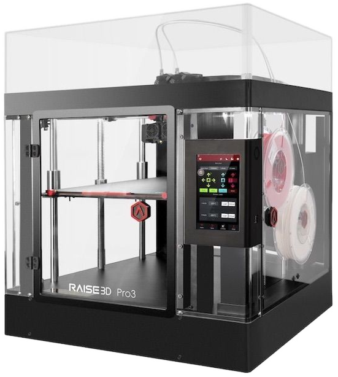

*ABS material properties and considerations in FDM 3D printing.*

## Table of Contents

- [Overview](#overview)
    - [Material Categories](#material-categories)
- [Material Considerations](#material-considerations)
- [Printing Requirements](#printing-requirements)
- [Material Comparisons](#material-categories)
- [Further Reading](#further-reading)
- [Footnotes](#fn:1)

## Overview

The additive manufacturing industry and hobbyists worldwide continue to invent new methods to 3D print materials. Concrete, titanium, chocolate, and even glass are regularly 3D printed, but FDM machines that model thermoplastic remain the most common. Stores sell an entry-level FDM printer for $100[^1], while commercial FDM printers list for $10,000 or more.

This article focuses on 3D printing acrylonitrile butadiene styrene, or ABS: the material properties that make it attractive, what printing it requires, and a comparison with other commonly printed thermosplastics.

### Material Categories

For purposes of this article, we will discuss three different categories of 3D-printable plastics:

- Entry-level plastics: PLA, PETG, and TPU
- Engineering plastics: ABS, PA, PC, & fiber-reinforced polymers
- High-end plastics: PTFE, PEEK, PEI and other plastics that require special materials and environmental conditions to print

#### Entry-Level Plastics

Entry-level materials are within reach of any off-the-shelf FDM printer[^2]. They can be obtained easily at low cost, printed in open air, and are forgiving for novices. Air filtration with these platics is recommended in enclosed spaces[^3] but not absolutely necessary.

The requirements for printing these materials are very basic:

1. Nozzle temperatures up to 245°C (473°F);
2. Heated bed temperatures no higher than 80°C (176°F); and 
3. Air temperatures should be within 15°C (59°F) and 30°C (86°F).

Not all of these materials require a heated bed, they have relatively large printable temperature ranges, and can print in open air.

#### Engineering Plastics

Engineering plastics, including ABS, are commonly used in industrial processes and are natural uses of 3D printing for prototypes and testing. Engineering plastics print at higher temperatures and require more environmental control than entry-level materials:

1. Nozzle temperatures 245°C - 280°C (473°F - 536°F);
2. Heated bed temperatures 90°C - 120°C (194°F - 248°F);
3. Air temperatures 40C (104°F) or higher;
4. Air filtration or venting; and/or
5. Controlled air circulation.

Of this list, the last two require the use of an enclosure and #3 typically needs one. The specific requirements for printing ABS are [below](#printing-requirements). Note that the last item, controlled air circulation, is *not* the same as a normal part cooling fan and refers to controlled circulation of air around the print environment.

#### High-End Plastics

Lastly, there are high-end plastics. Materials in this category are often used as heat-resistant materials in manufacturing. Printing these plastics requires the use of other materials that can tolerate even higher temperatures. As a result, high-end plastics require a machine carefully designed to safely print at extreme temperatures.[^5] These are typically commercial printers or bespoke hobbyist machines.

As a rough cutoff, engineering plastics end and high-end plastics begin when a material requires any one of the the following:

- Nozzle temperatures 280°C (536°F) and higher;
- Heated bed temperature above 125°C (257°F) and higher; and/or
- Ambient temperatures over 60°C (140°F) or an actively heated enclosure.

## Material Considerations

ABS is widely used as a durable plastic: it resists everyday wear-and-tear, is cheap to source, and can be injection molded. Injection molding allows mass production at extremely low per-unit costs but the required molds have a high up-front cost. 3D printed parts can be nearly as strong as an injection molded equivalents; this allows cheap prototypes before committing to an expensive mold.[^4]

Prototyping parts for injection molding was one of the first commercial uses of FDM 3D printing. Under the right environmental conditions, ABS is also easy to 3D print.

Below are some general properties of ABS plastic. We'll get into more detail in the next section about how ABS behaves when printed.

**Pros**

- Thermoplastic; can be heated repeatedly without damage
- Affordable and easily sourced
- Rigid & impact resistant
- High continuous service temperature
- Good insulator
- Fair chemical resistance
- Good electrical insulation
- Can be sterilized for (single) medical use
- Takes paint and glue
- Easily machined

**Cons**

- Not UV-stable (degrades in sunlight)
- Difficult to recycle
- Poor solvent resistance
- Not food safe
- Burning produces toxic off-gassing

ABS has several properties in the "Pros" list that are useful for manufacturers, particularly that it can be heated, machined, glued, painted, and molded. It tolerates most temperatures in the home outside of open flame, though food safety and burning are both concerns.

Since both food safety and solvents are a problem, ABS is generally kept away from garages and kitchens. Lastly, ABS degrades under UV light and will yellow and crack over time. ASA is a related material that is often used when direct sunlight is expected; it tolerates higher temperatures than ABS and will not degrade under UV light.

ABS recycling is possible, but relatively new and hard to find.

## Printing ABS

### Requirements

The general conditions for printing engineering plastics are listed [above](#engineering-plastics). ABS needs all five of them but can be surprisingly forgiving, particularly as the air temperature rises.

1. Nozzle temperature: 235°C - 255°C (455°F - 491°F)
2. Heated bed: 90°C - 110°C (194°F - 230°F)
3. Air temperature: 30° - 75°C (86° - 167°F)
4. Air filtration is required.
5. Airflow improves print performance under certain conditions.

Entry-level 3D printers are generally capable of handling the nozzle and bed temperatures required by ABS; a good enclosure does the rest. The exception to this case are some printers that allow a PTFE Bowden tube to contact the nozzle as part of the design. PTFE begins to degrade and off-gas around 250°C, and these printers are thus limited to 235°C for safety. Well-designed hotends terminate the Bowden further above the nozzle, inside an actively-cooled metallic heatsink.

### Enclosures

An enclosure protects a in-progress 3D print from environmental changes. On the lowest end, a cardboard box covering a 3D printer is an enclosure. On the high end, enclosures are prefabricated and provide a range of features:

- Environmental control,
- HEPA/activated carbon air filtration or a venting system,
- Lighting,
- Sound dampening, and in some cases,
- Active heating.

In terms of 3D printing, enclosures are either external or integrated to the printer. With an external enclosure, an existing printer is installed inside an enclosure that may or may not have been designed for the specific printer. An integrated enclosure is built into the frame of the printer; on some printers this is sold as an optional add-on. Integration makes enclosure smaller and can add rigidity to the printer frame.

=== "External Enclosure"
    {width="400px"}
=== "Integrated Enclosure"
    {width="400px"}

Materials used to manufacture an enclosure vary widely, from steel or aluminum to a variety of woods and plastics.

ABS and other engineering plastics also need an enclosure for safety. Continuous filtration or a venting mechanism is necessary to evacuate or trap styrene and other VOCs given off by ABS. Quality enclosures monitor the air temperature and vent air to prevent overheating.

#### Dispelling a Myth

A common myth about ABS is that it should be printed without a part cooling fan, but this is not true in an insulated enclosure. A part cooling fan blows on the printer's nozzle and blasts freshly-extruded plastic with air to "set" the material by quickly cooling it. This helps to prevent sagging other blemishes. Materials like PLA benefit greatly from part cooling fans.

ABS is prone to warping when it is cooled too quickly, and the common belief is that a part cooling fan should not be used.In an enclosure where the air is at least 45°C (113°F), ABS behaves much like PLA printed in open air. After the initial cooling blast of air, the enclosure's high ambient temperature prevents warp by allowing the ABS to continue cooling more gradually.

With PLA and PETG, the answer is often "more part cooling". In many cases, issues in ABS printing are solved by a hotter enclosure *and* more part cooling.

### Air Filtration and Temperature Control

Temperature control does not have to be built-in to an enclosure, but it does need to be present. Likewise, air filtration is important unless the air is vented outside.[^6] 

### Pros and Cons

**Pros**

- Easily post-processed by sanding, acetone smoothing, drilling, etc.
- Excellent layer adhesion
- Minimal warp for smaller parts
- Predictable shrinkage

**Cons**

- Prone to warping in uncontrolled/cooler print environments
- Toxic off-gassing from styrene
- Moisture adsorbtion affects print quality
- ABS supports are difficult to remove

## Material Comparisons

Formulas for materials vary by manufacturer; as a result, recommended nozzle temperatures vary between manufacturers and product lines.

### Print Temperatures

| Material | Nozzle Temp. | Bed Temp. | Air Temp. | Notes |
|---|---|---|---|---|
| PLA | 180-220°C | 25-65°C | 15-30°C | Most common 3D-printed material due to low melting point. |
| TPU | 210-250°C | 25-60°C | 15-30°C | Required nozzle temperatures vary widely by material formula. |
| PETG | 230-250°C | 70-80°C | 15°-30°C | PETG is at the upper range of capabilities for most entry-level printers. |
| ABS | 230-250°C | 90-110°C | 45°C+ | Once the air temperature is 75°C, a heated bed is no longer necessary to print ABS. |
| ASA | 235-255°C | 90-110°C | 45°C+ | ASA has nearly identical print requirements to ABS. |
| PA | 230-260°C | 60-110°C | 45°C+ | Required temperatures vary widely by material formula. |
| PC | 260-300°C | 80-120°C | 45°C+ | Higher air temperatures reduce warping; must be annealed after printing to relieve stress. |
| PP | 220-250°C | 85-100°C | 45-60°C | Higher air temperatures reduce warping. |

### Material Properties

PA6 is a particular form of PA that is used for reference here. Different forms of PA/Nylon have very different properties.

| Property                                   | ABS        | PLA          | PETG        | PA6         | Notes |
|--------------------------------------------|------------|--------------|-------------|-------------|-------|
| [Tensile strength][wp_uts] (MPa)           | 40         | 65           | 53          | 40 - 85     | ABS does not stretch well; see hardness below. |
| [Flexural modulus][flex_modulus] (GPa)     | 1.6 - 2.4  | 0.167 - 13.8 | 2.2         | 0.8 - 2.0   | ABS is slightly flexible but Unmodified PLA is at the low end of the range given. |
| [Young's modulus][young_modulus]           | 1.79 - 3.2 | 3.4 - 3.6    | 1.9 - 2.0   | 0.8 - 2.0   | 
| Continus service temperature (°C)          | 80 - 95    | < 53         | 63          | 150         | 
| [Density][density] (g/cm^4^)               | 1.0 - 1.05 | 1.21 - 1.43  | 1.27 - 1.38 | 1.13 - 1.35 |
| [Hardness][hardness] (Shore D)             | 100        | 63-87        | 78          | 80 - 95     |

## Further Reading

1. [Acrylonitrile Butadiene Styrene](https://en.wikipedia.org/wiki/Acrylonitrile_butadiene_styrene). *Wikipedia, the free encyclopedia.*
2. [Comprehensive Guide on Acrylonitrile Butadiene Styrene (ABS)](https://omnexus.specialchem.com/selection-guide/acrylonitrile-butadiene-styrene-abs-plastic). *Omnexus*.
3. [What is ABS Material?](https://plasticextrusiontech.net/what-is-abs-material/) *Plastic Extrusion Technologies*. Oct 8, 2021.
4. [Deflection Temperature Testing of Plastics](https://www.matweb.com/reference/deflection-temperature.aspx). *MatWeb*.
5. [A Guide to ABS Plastic Injection Molding Process](https://www.rapiddirect.com/blog/abs-injection-molding/). *Rapid Direct*. Feb 27, 2022.
6. [What is a Thermoplastic?](https://www.twi-global.com/technical-knowledge/faqs/what-is-a-thermoplastic). *TWI Global*.
7. [Filament Properties Table](https://www.simplify3d.com/resources/materials-guide/properties-table/). *Simplify 3D*.

[^1]: Specifically, the Creality Ender 3 Pro lists for around $100USD. Higher quality entry-level machines can be found for $250-$300.

[^2]: Without significant or expensive modification.

[^3]:
    When printed, all plastics off-gas VOCs and microparticles of plastic. Some plastics are typically printed in open air, but **lack of unpleasant odor does not equal safety**. An activated carbon/HEPA filter combination in the same room as a 3D printer (preferably near the build area) is considered sufficient for open-air printing, but research is ongoing.

[^4]: 
    A familiar use of ABS for injection molding is the manufacture of LEGO bricks.

[^5]: 
    For example, PEI is used to coat 3D printer heated beds.

[^6]: 
    Enclosures should be able to vent air to control the temperature; a vent hood typically exhausts air outside the building rather than filtering it. The exhaust is usually routed by duct out a window or through the ceiling.

*[FDM]: Fusion deposition modeling: a method of 3D printing material in layers by extruding heated plastic through a nozzle.
*[HDT]: Heat-deflection temperature: the temperature where a material under a fixed amount of stress begins to bend.
*[VOC]: Volatile organic compounds: these off-gas from many common products and chemicals, including during 3D printing.
*[VOCs]: Volatile organic compounds: these off-gas from many common products and chemicals, including during 3D printing.
*[PLA]: Polylactic acid: a brittle plastic with a low melting point; widely used for 3D printing.
*[PETG]: Polyethylene terephthalate glycol: a clear, slightly flexible polymer widely used for food-safe purposes.
*[TPU]: Thermoelastic polyurethane: a family of highly elastic polymers with a wide range of uses; often compared to rubber in mechanical properties.
*[PA]: Polyamide: a family of polymers that includes Nylon.
*[PC]: Polycarbonate: a family of polymers known for extreme hardness, resistance to heat, and clarity.
*[PTFE]: Polyfluorotetraethylene: also known as Teflon, PTFE tolerates very high temperatures but produces toxic gas when heated enough.
*[PMMA]: Poly(methyl methacrylate): a highly clear, rigid plastic commonly known as acrylic.
*[PEEK]: Polyether ether ketone: a plastic with exceptional mechanical, chemical, and thermal properties that is commonly used in extreme conditions (up to 500C).
*[ASA]: Acrylonitrile styrene acrylate: a UV-stable and more heat-resistant polymer related to ABS.
*[PEI]: Polyetherimide: a plastic similar to PEEK with a higher temperature range and adhesive properties; frequently used on 3D printer beds.
*[PP]: Polypropylene: lightweight material that is microwave- and dishwasher-safe. Commonly found in packing materials and drink bottles.
*[thermoplastic]: Thermoplastics are a class of polymers that can be heated enough to soften, processed into a desired shape, then allowed to cool. These plastics are normally safe to heat and reheat indefinitely without destructive effect, making them easy to recycle, amongst other benefits.
*[off-gas]: Plastics heated sufficiently break down and release gaseous byproducts; this is called off-gassing.

[wp_uts]: https://en.wikipedia.org/wiki/Ultimate_tensile_strength "Ultimate tensile strength: how far a material can be stretched before breaking"
[flex_modulus]: https://omnexus.specialchem.com/polymer-properties/properties/flexibility "Flexural modulus: the tendency for a material to resist bending, defined by ratio of stress to strain."
[young_modulus]: https://omnexus.specialchem.com/polymer-properties/properties/young-modulus "Young's Modulus: stiffness of a material when force is applied to the long axis"
[density]: https://omnexus.specialchem.com/polymer-properties/properties/density "The mass of a material per volume, given as grams per cubic centimeter for solids."
[hardness]: https://omnexus.specialchem.com/polymer-properties/properties/hardness-introduction "Hardness refers to how a material reacts to pressure applied by a harder material; it is measured in multiple scales."