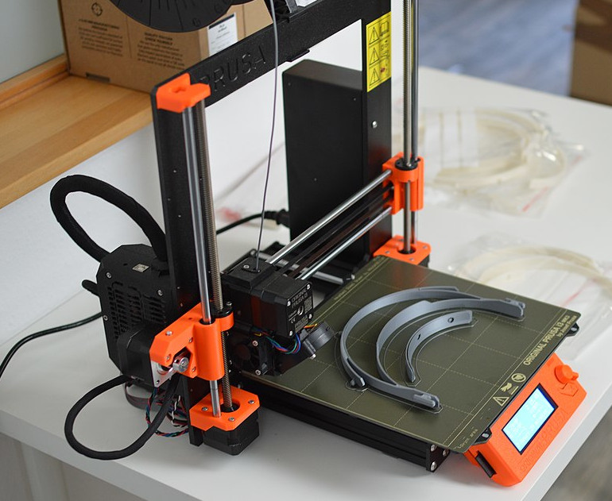
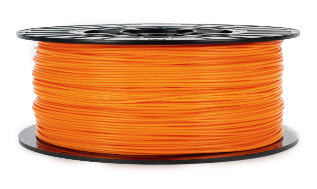
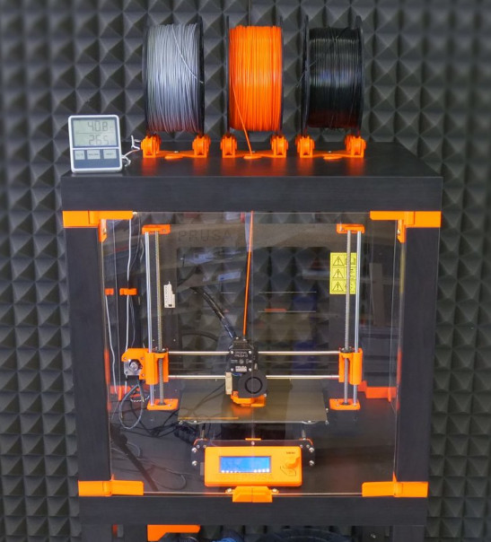
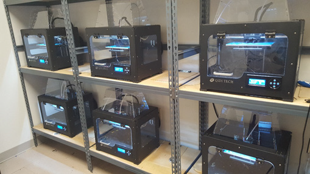
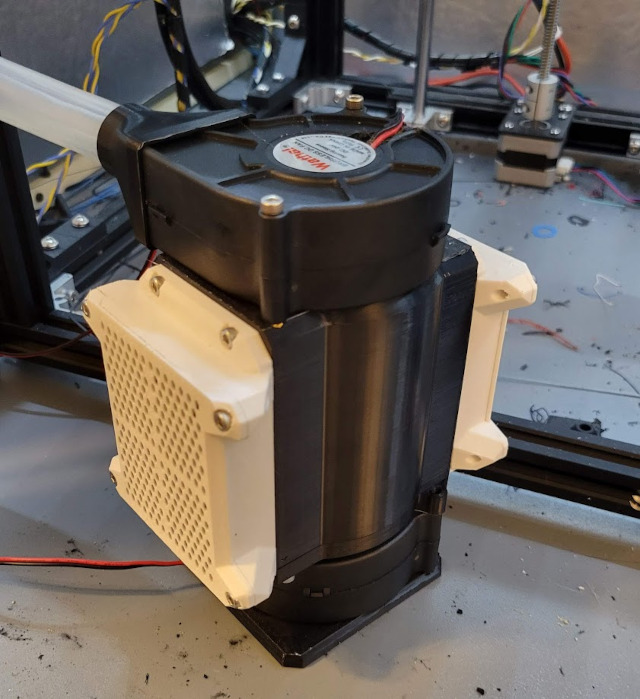
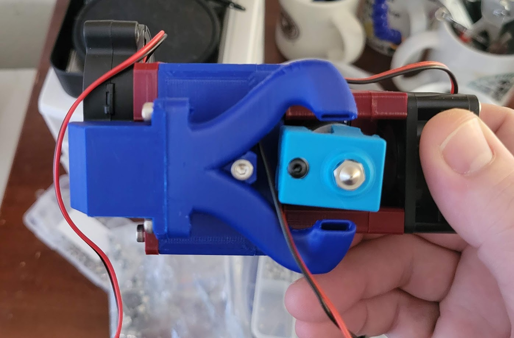

*ABS material properties and considerations in FDM 3D printing.*

## Overview

The additive manufacturing industry and hobbyists worldwide continue to invent new methods to 3D print materials. [Concrete](https://www.mudbots.com/), [titanium](https://www.protolabs.com/services/3d-printing/direct-metal-laser-sintering/titanium/), [chocolate](https://cocoapress.com/), and [glass](https://nobula3d.com/) are regularly 3D printed, but FDM machines that model thermoplastic remain the most common. Stores sell an entry-level FDM printer for $100[^1], while commercial FDM printers list for $10,000 or more.

This article focuses on a specific 3D-printable material, acrylonitrile butadiene styrene (ABS): 

- The material properties that make it attractive,
- What printing ABS requires, and
- A comparison with 3D-printable thermoplastics.

<figure markdown>

<figcaption markdown>
An FDM 3D printer, manufactured by Prusa. Credit: [European Space Agency](https://www.esa.int/ESA_Multimedia/Images/2020/04/3D_printer_EAC#.XqbGVblUaYs.link)
</figcaption>
</figure>

### What is ABS?

ABS is a type of thermoplastic. It does not have outstanding performance, but rather offers mostly good characteristics across a broad range.

The name acrylonitrile butadiene styrene is an ingredient list, as ABS is made by polymerizing (chemically joining into long chains) these three materials, called *monomers*. Varying the ratio of each component produces slightly different characteristics.[^7] Other polymers can be added to further tweak the final product's properties.

ABS is noteworthy for being easy and affordable to manufacture. Because it is an amorphous polymer, when heated it can be extruded and molded like glass. It is machinable at room temperature and can be chemically welded with many solvents. Combining these techniques allows manufacturers multiple ways to fabricate parts with ABS and contributes to the popularity of ABS in manufacturing.

<figure markdown>

<figcaption markdown>
A bag of resin pellets. Credit: [SuSanA Secretariat](https://www.flickr.com/people/23116228@N07)
</figcaption>
</figure>

Manufacturers of base ABS material create pellets called *plastic resin*. From there, manufactures melt the material, optionally adding colorants or other materials to modify the properties of the final product. The melted material is then formed into shape; for FDM filament manufacturers, this means stretching the material into filament (long, thin cylinders of a uniform diameter) and rolling them onto spools.

<figure markdown>

<figcaption markdown>
A spool roll of Orange Prusament filament. Credit: Prusa Research
</figcaption>
</figure>

### Material Categories

For purposes of this article, we will discuss three different categories of 3D-printable plastics:

- Entry-level plastics: 
    - PLA (polylactic acid)
    - PETG (polyethylene terephthalate glycol)
    - TPU (thermoelastic polyurethane)
- Engineering plastics:
    - ABS (acrylonitrile butadiene styrene)
    - ASA (acrylonitrile budadient acrylate)
    - Nylon/PA (polyamide)
    - PC (polycarbonate)
    - PP (polypropylene)
- High-end plastics: 
    - PTFE (polytetraflouroethylene)
    - PEEK (polyether ether ketone)
    - Ultem/PEI (polyetherimide)
    - Acrylic/PMMA (poly(methyl methacrylate))

These lists are incomplete. Some materials, like PC and PP, qualify as engineering or high-end depending on the formulation used.

**Entry-Level Plastics**

Entry-level materials are printable by nearly any off-the-shelf FDM printer[^2]. They are low cost, easily obtained, printable in open air, and relatively forgiving for novices. Air filtration with these plastics is recommended indoors[^3] but is not absolutely necessary.

The requirements for printing entry-level plastics are very basic:

1. Nozzle temperatures up to 245°C (473°F);
2. Heated bed temperatures no higher than 80°C (176°F); and 
3. Air temperatures should be within 15°C (59°F) and 30°C (86°F).

Entry-level plastics have wide melt ranges and not all require a heated bed. 

**Engineering Plastics**

Engineering plastics, including ABS, have widespread use in other manufacturing industries. Engineering plastics print at higher temperatures and require more environmental control than entry-level materials:

1. Nozzle temperatures 230°C - 280°C (446°F - 536°F);
2. Heated bed temperatures up to 110°C (248°F);
3. Air temperatures 40°C (104°F) or higher;
4. Air filtration or venting; and
5. Benefit from uniform air temperature.

Of this list, the #4 and #5 require an enclosure and #3 typically needs one.

Note that the last item, uniform air temperature, is *not* related to using a part cooling fan; instead, it refers to using fans to evenly distribute heat around the print environment. This is largely beneficial when printing larger parts that may otherwise cool unevenly.

The specific requirements for printing ABS are [below](#printing-requirements).

**High-End Plastics**

Lastly, there are high-end plastics. Materials in this category are often used as heat-resistant materials in manufacturing. Printing these plastics requires the use of other materials that can tolerate even higher temperatures. As a result, high-end plastics require a machine carefully designed to safely print at extreme temperatures.[^5] These are typically commercial printers or bespoke hobbyist machines.

As a rough cutoff, engineering plastics end and high-end plastics begin when a material requires any one of the the following:

- Nozzle temperatures over 280°C (536°F);
- Heated bed temperature over 110°C (230°F); and/or
- Air temperatures over 60°C (140°F).

This article does not delve into high-end plastics, but they are important because ABS is used as an affordable substitute (and a much more easily printed one).

## Material Considerations

One of the largest uses of ABS is injection molding. Injection molding allows mass production at extremely low per-unit costs with a high up-front cost for the molds and prototype(s).[^4]

Prototyping ABS parts for injection molding was one of the first commercial uses of FDM 3D printing. 3D printed parts can be nearly as strong as an injection molded equivalents; this allows cheap prototypes before committing to an expensive mold. Under the right conditions, ABS is also easy to 3D print.

Below are some general properties of ABS plastic. We'll get into more detail in the next section about how ABS behaves when printed.

**Pros**

- Thermoplastic (can be heated repeatedly without damage)
- Affordable and easily sourced
- Rigid & impact resistant
- High continuous service temperature
- Easily machined
- Can be painted 
- Can be chemically glued
- Good heat insulator
- Excellent electrical insulator
- Can be sterilized for single medical use
- Easily recycled in industrial conditions

**Cons**

- Not UV-stable (degrades in sunlight)
- Fair chemical resistance
- Difficult to recycle for consumers
- Poor solvent resistance
- Not food safe
- Burning produces toxic off-gassing

ABS has several properties in the "Pros" list that are useful for manufacturers, particularly how easily it can be shaped and machined. ABS tolerates most temperatures in the home outside of open flame, though food safety and burning when exposed to open flame are both concerns.

Since both food safety and solvents are a problem, ABS is generally kept away from garages and kitchens. Lastly, ABS degrades under UV light and will yellow and crack over time when left in sunlight. A UV-stable substitute, ASA, is discussed in more detail under [Alternatives](#alternatives).

ABS recycling is widely performed but is generally not available to consumers.

## Printing ABS

### Requirements

The general conditions for printing engineering plastics are listed [above](#engineering-plastics). ABS needs all five of them but can be surprisingly easy to print, particularly as the air temperature rises.

1. Nozzle temperature: 235°C - 255°C (455°F - 491°F)
2. Heated bed: 90°C - 110°C (194°F - 230°F)
3. Air temperature: 30°C - 75°C (86°F - 167°F)
4. Air filtration is required.
5. Airflow improves print performance under certain conditions.

Entry-level 3D printers are generally capable of handling the nozzle and bed temperatures required by ABS; a good enclosure does the rest.[^8]

Note that some modified ABS materials (often called ABS+) can be printed at lower nozzle, bed, and air temperatures but also have lower operating temperatures. They may not be as performant in some areas, particularly heat tolerance.

### Extruding ABS

<figure markdown>

<figcaption markdown>
A diagram of an E3D V6 all-metal hotend. Credit: [Prusa Research](https://help.prusa3d.com/article/extrusion-stopped-mid-print-heat-creep_1948)
</figcaption>
</figure>

FDM 3D printers push plastic filament into a *heater block* hot enough to melt the filament; the now-liquid plastic is squeezed out through a metal nozzle. In the image above, a heater cartridge heats the heater block and nozzle. A thermistor senses the temperature and provides feedback to control the nozzle temperature. The whole of the assembly pictured above is called the *hotend*. A stepper motor (not pictured) pushes filament through the hotend and out of the nozzle.

Not all hotends are designed to print ABS due to an inadequate *heatbreak*. In the image above, a PTFE tube (pale green) containing filament passes through the heat sink and ends at the heatbreak. Heatbreaks connect the heater block to the heatsink and are designed to transfer as little heat as possible between them. The combination of heat sink and the slow heat transfer of the heatbreak keeps filament well below its melting point until it reaches the heater block.

Low-end hotends pass the PTFE tube through the heatbreak to butt against the nozzle. This limits the nozzle temperature to the maximum safe operating temperature of PTFE (about 235°C), which is generally inadequate for printing ABS. Hotends with a heatbreak that separates the PTFE tube and nozzle are termed *all-metal hotends*.

### Enclosures

An enclosure protects an in-progress 3D print from environmental changes. A cardboard box covering a 3D printer is an enclosure, albeit hazardous and makeshift. Mylar tents are a common and less dangerous option. Quality enclosures are more permanent and made of durable materials[^10]; they may provide a range of features:

- Environmental control,
- Air filtration or a venting system,
- Lighting,
- A large door or access hatch,
- Sound dampening, and
- (In some cases) active heating.

3D printer enclosures are either integrated to the printer or external. With an external enclosure, an existing printer is installed inside an enclosure that may or may not have been designed for the specific printer. An integrated enclosure is built into the frame of the printer; on some printers this is sold as an optional add-on. Integration makes enclosure smaller and can add rigidity to the printer frame.

=== "External Enclosure"
    <figure markdown>
    {width="400px"}
    <figcaption markdown>
    An enclosure made from IKEA LACK tables. Credit: Prusa Research
    </figcaption>
    </figure>
=== "Integrated Enclosure"
    <figure markdown>
    
    <figcaption markdown>
    QIDI Tech printers with integrated enclosures. Credit: public domain
    </figcaption>
    </figure>
    

### Filtration and Fire Safety

Temperature control does not have to be built-in to an enclosure, but it should be present for safety. An enclosure sufficient heat production (and insulation) may reach temperature that risk electrical fires. An enclosure should have a method to monitor the air temperature and automatically cools the air or shut down. The most common method of cooling is through an exhaust vent, whether filtered or unfiltered.[^6]

Some enclosures have active heating elements to reach very high temperatures; these are uncommon outside of high-end commercial printers. For safety reasons, the hobbyist printer design group [VORON Design](https://vorondesign.com/) notably does not allow discussion of active heating methods in their online communities.

Continuous filtration or a venting mechanism is necessary to evacuate or trap styrene and other VOCs given off by ABS. At a minimum, ABS air filtration requires coconut shell (acid-free) activated carbon to remove styrene from the air. The addition of a HEPA filter also removes larger microplastics that may also be hazardous.

<figure markdown>

<figcaption markdown>
An activated carbon and HEPA air filter with dedicated internal filter fan and external exhaust fan. Credit: Jon Harper/[SUAFT](https://jon-harper.github.io/air_filter)
</figcaption>
</figure>

### The Part Cooling Myth

<figure markdown>

<figcaption markdown>
The blower at top left directs air through the duct and to a point just underneath the nozzle at center. Credit: Jon Harper.
</figcaption>
</figure>

A common myth about ABS is that it should be printed without a part cooling fan. Part cooling fans blow air on the plastic extruded from a 3D printer's nozzle. This "sets" the material by quickly cooling it and helps to prevent sagging other blemishes. Materials like PLA benefit greatly from part cooling fans.

ABS is prone to warp and layer separation when cooled too quickly. A belief developed that part cooling fans cause this; rather, this is a sign that the ambient air temperature is not hot enough. At around 45°C (113°F), ABS behaves much like PLA printed at room temperature and should always have a part cooling fan. After the initial cooling blast of air, the enclosure's high air temperature allows the ABS to continue cooling more gradually, preventing warp and delamination.

With PLA and PETG, the answer is often "more part cooling". In many cases, issues in ABS printing are solved with a hotter enclosure first, and then adding more part cooling.

### Pros and Cons

We've set the conditions and requirements for printing ABS. What's it like to actually use ABS?

**Pros**

- Easily post-processed by sanding, acetone smoothing, drilling, etc.
- Excellent layer adhesion
- Minimal warp for smaller parts
- Predictable shrinkage

**Cons**

- Prone to warping in uncontrolled/cooler print environments
- Toxic off-gassing from styrene
- Moisture adsorbtion affects print quality
- ABS supports are difficult to remove

Like ABS in other manufacturing fields, printed ABS can be machined, sanded, drilled and otherwise post-processed as needed. 

ABS adheres to itself *very* well, so parts made from ABS are hard to separate at the layer lines. This benefit has a downside, in that printed supports are difficult to impossible to remove from ABS prints without damaging them.[^9]

ABS has a low, predictable shrink when allowed to cool gradually; high-shrink materials like PC must be annealed after printing to relieve internal stress. Small parts have little difficulty with warping due to uneven cooling, as well.

In imperfect conditions, generally due to too-low bed and air temperatures, ABS behaves very poorly. At room temperature, ABS is nearly impossible to print properly.

A final note on moisture: ABS does not *ab*sorb moisture (take up), it *ad*sorbs it (becomes externally coated in it). This is an issue with ABS printing; moisture-coated filament produces pockets of steam inside the heater block. These pockets exit the nozzle with a distinctive noise and produce imperfections in the resulting print.

## Material Comparisons

### Print Temperatures

Material composition varies between manufacturers and product lines. Many manufacturers tweak a product's formula for lower nozzle temperatures, particularly for filaments with high requirements. As a result, these numbers are only a general guide developed by comparing multiple sources.

| Material | Nozzle Temp. | Bed Temp. | Air Temp. | Notes |
|---|---|---|---|---|
| PLA | 180-220°C | 25-65°C | 15-30°C | Most common 3D-printed material due to low melting point. |
| TPU | 210-250°C | 25-60°C | 15-30°C | High flexibility makes this material unusually difficult to print. |
| PETG | 230-250°C | 70-80°C | 15°-30°C | PETG is at the upper range of capabilities for most entry-level printers. |
| **ABS** | **230-250°C** | **90-110°C** | **45°C+** |  |
| ASA | 235-255°C | 90-110°C | 45°C+ |  |
| PA | 230-260°C | 60-110°C | 45°C+ | Some forms of PA do not require a heated enclosure. |
| PP | 220-250°C | 85-100°C | 45-60°C | |
| PC | 260-300°C | 80-120°C | 45°C+ | Must be annealed after printing to relieve stress. |

### Price

The filaments below are primarily from [Polymaker](https://us.polymaker.com). Polymaker was chosen because they carry a wide range of materials at a market prices and offer Technical Data Sheets for their products.

| Material | Unit Price ($/kg) | Source Filament |
|----------|-------------------|-----------------|
| **ABS**  | **22**            | [**PolyLite ABS**](https://us.polymaker.com/products/polylite-abs)
| ASA      | 30                | [PolyLite ASA](https://us.polymaker.com/products/polylite-galaxy-asa) |
| PA6      | 67                | [PolyMide CoPA](https://us.polymaker.com/products/polymide-copa) |
| PC       | 52                | [PolyMax PC](https://us.polymaker.com/products/polymax-pc) |
| PETG     | 22                | [PolyLite PETG](https://us.polymaker.com/products/polylite-petg) |
| PLA      | 23                | [PolyLite PLA](https://us.polymaker.com/products/polylite-pla) |
| PLA+/Pro | 25                | [PolyLite PLA Pro](https://us.polymaker.com/products/polylite-pla-pro) |
| PP       | 83                | [SmartMaterials Polypropylene](https://www.matterhackers.com/store/l/natural-smartmaterials-smartfil-polypropylene-filament-175-07/sk/M8D8XF6V) |
| TPU (Shore 95A)  | 40        | [PolyFlex TPU95A](https://us.polymaker.com/products/polyflex-tpu95) |

### General Properties

| Property/Material      | ABS  | PA6  | PC   | PLA  | PETG |
|------------------------|------|------|------|------|------|
| Density (g/cm^3^)      | 1.12 | 1.12 | 1.19 | 1.19 | 1.25 |
| HDT @ 0.45MPa (°C)     | 100  | 111  | 111  | 60   | 78   |
| HDT @ 1.8MPa (°C)      | 98   | 70   | 107  | 58   | 75   |
| Vicat Softening Temperature (°C) | 104 | 180 | 120 | 158 | 84 |

### Mechanical Properties

| Property                         | ABS  | PA6  | PC   | PLA  | PETG |
|----------------------------------|------|------|------|------|------|
| XY Axis Tensile Strength (MPa)   | 33   | 66   | 63   | 52   | 32   |
| Z Axis Tensile Strength (MPa)    | 25   | 43   | 42   | 41   | 13   |
| XY Axis Young's Modulus (GPa)    | 2.17 | 2.22 | 2.31 | 3.43 | 1.47 |
| Z Axis Young's Modulus  (GPa)    | 1.84 | 2.56 | 2.26 | 3.01 | 1.09 |
| Flexural Modulus (GPa)           | 2.8  | 1.67 | 2.2  | 3.28 | 1.17 |
| Elongation at Break (%)          | 2.4  | 4.6  | 2.2  | 1.8  | 1.3  |
| Charpy Impact Test (KJ/m^2^)      | 12.6 | 17.2 | 3.4  | 3.3  | 5.1  |

### Alternatives

Before substituting another material, consider a different formulation of ABS or a blend with additives. The simplest way to modify the characteristics of an ABS resin is to vary the ratio of the three ingredient monomers, and this is the reason different manufacturers offer ABS with varying properties. For the same reason, good filament manufacturers offer Technical Data Sheets on their products.

One issue with ABS is that it degrades under UV light (particularly direct sunlight). ASA is an alternative that behaves much like ABS when printed, offers a higher heat tolerance, weather-resistance, and UV-stability. It is, however, more expensive than ABS, harder to source, and generally available in fewer colors.

Filament made from resin with additives can greatly enhance specific properties, such as [flame retardance](https://atomicfilament.com/collections/abs-3d-filament/products/flame-retardant-black-abs-filament?variant=39943214891069) and [resistance to ESD](https://www.matterhackers.com/store/l/3dxtech-3dxstat-esd-safe-abs-filament/sk/MA9K94YF). Materials commonly added to ABS include PMMA (clarity), PC (heat resistance), and ASA (UV stability).

Another option are fiber "fills". In the past five or so years, manufacturers began selling filaments with up to 30% fiber content. These glass- and [carbon-fiber](https://atomicfilament.com/collections/abs-3d-filament/products/carbon-fiber-ultra-black-abs) doped filaments have higher heat resistance, stiffness, and dimensional stability. Carbon-fiber-filled ABS (CF-ABS) is the most commonly found form of ABS fill.

More ABS blends and alternatives are likely to make their way into filament. Thermoplastic resin manufacturers ([Sabic](https://www.sabic.com/en/products/polymers/acrylonitrile-butadiene-styrene-abs) is one example) sell a much wider array of resins than currently make their way into filaments. As FDM 3D printing popularity grew in the last decade, filament manufactures greatly increased the variety of resins used to make filament; this trend will likely continue.

## Summary

ABS plastic is an excellent all-purpose plastic for 3D printing functional parts. Although it requires an enclosure to print safely and well, it is both the easiest engineering-grade plastic to print and one of the most affordable. 

When a UV-stable and weather-resistant alternative is needed, ASA can be substituted at a higher price point. Blends and fills are available to give ABS other desired properties.

## Further Reading

### ABS

- [Acrylonitrile Butadiene Styrene](https://en.wikipedia.org/wiki/Acrylonitrile_butadiene_styrene). *Wikipedia, the free encyclopedia.*
- [Comprehensive Guide on Acrylonitrile Butadiene Styrene (ABS)](https://omnexus.specialchem.com/selection-guide/acrylonitrile-butadiene-styrene-abs-plastic). *Omnexus*.
- [What is ABS Material?](https://plasticextrusiontech.net/what-is-abs-material/) *Plastic Extrusion Technologies*. Oct 8, 2021.
- [A Guide to ABS Plastic Injection Molding Process](https://www.rapiddirect.com/blog/abs-injection-molding/). *Rapid Direct*. Feb 27, 2022.

### General Plastics

- [What is a Thermoplastic?](https://www.twi-global.com/technical-knowledge/faqs/what-is-a-thermoplastic). *TWI Global*.
- [What is a Polymer?](https://www.livescience.com/60682-polymers.html). *LiveScience*. Oct 13, 2017.
- [What is plastic resin? How is Plastic Resin Made?](https://europlas.com.vn/en-US/what-is-plastic-resin-how-is-plastic-resin-made). *EuroPlas*.
- [What is injection moulding?](https://www.twi-global.com/technical-knowledge/faqs/what-is-injection-moulding). *TWI Global*.

### Material Properties

- [Deflection Temperature Testing of Plastics](https://www.matweb.com/reference/deflection-temperature.aspx). *MatWeb*.
- [Filament Properties Table](https://www.simplify3d.com/resources/materials-guide/properties-table/). *Simplify 3D*.

[^1]: Specifically, the Creality Ender 3 Pro lists for around $100USD. Higher quality entry-level machines can be found for $250-$300.

[^2]: Without significant or expensive modification.

[^3]:
    During the extrusion process, all plastics off-gas VOCs and microparticles of plastic. Some plastics are typically printed in open air, but **lack of unpleasant odor does not equal safety**. An activated carbon/HEPA filter combination in the same room as a 3D printer (preferably near the build area) is considered sufficient for open-air printing, but research is ongoing.

[^4]: 
    A familiar use of injection-molded ABS is in the manufacture of LEGO bricks.

[^5]: 
    For example, PEI is used to coat 3D printer heated beds, which can reach 125°C or more.

[^6]: 
    An unfiltered exhaust ducts air outside the building, usually out a window or through the ceiling.

[^7]:
    For this reason, properties of ABS and many other plastics (density, etc.) are often given within a range.

[^8]:
    The exception to this are hotends designed with a PTFE Bowden tube contacting the nozzle. PTFE begins to degrade and off-gas around 250°C, and these printers are thus limited to 235°C for safety. Well-designed hotends terminate the Bowden further above the nozzle, inside an actively-cooled metallic heatsink.

[^9]:
    Supports are sacrificial material that is added to a 3D print. If a design includes a portion with nothing underneath, something must keep the hot plastic from falling while it cools. Supports are added to a print (generally automatically by software) to keep the plastic in place.
    
    After a print completes, supports are meant to be snapped off; with ABS, the layer adhesions is sufficient to make support removal destructive to the print.
    
[^10]: Materials used to manufacture enclosures vary from metals like steel or aluminum to woods and plastics. Acrylic (PMMA) is commonly used for windows and doors for visibility.

*[FDM]: Fusion deposition modeling: a method of 3D printing material in layers by extruding heated plastic through a nozzle.
*[HDT]: Heat-deflection temperature: the temperature where a material under a fixed amount of stress begins to bend.
*[VOC]: Volatile organic compounds: these off-gas from many common products and chemicals, including during 3D printing.
*[VOCs]: Volatile organic compounds: these off-gas from many common products and chemicals, including during 3D printing.
*[PLA]: Polylactic acid: a brittle plastic with a low melting point; widely used for 3D printing.
*[PETG]: Polyethylene terephthalate glycol: a clear, slightly flexible polymer widely used for food-safe purposes.
*[TPU]: Thermoelastic polyurethane: a family of highly elastic polymers with a wide range of uses; often compared to rubber in mechanical properties.
*[PA]: Polyamide: a family of polymers that includes Nylon.
*[PC]: Polycarbonate: a family of polymers known for extreme hardness, resistance to heat, and clarity.
*[PTFE]: Polyfluorotetraethylene: also known as Teflon, PTFE tolerates very high temperatures but produces toxic gas when heated enough.
*[PMMA]: Poly(methyl methacrylate): a highly clear, rigid plastic commonly known as acrylic.
*[PEEK]: Polyether ether ketone: a plastic with exceptional mechanical, chemical, and thermal properties that is commonly used in extreme conditions (up to 500C).
*[ASA]: Acrylonitrile styrene acrylate: a UV-stable and more heat-resistant polymer related to ABS.
*[PEI]: Polyetherimide: a plastic similar to PEEK with a higher temperature range and adhesive properties; frequently used on 3D printer beds.
*[PP]: Polypropylene: lightweight material that is microwave- and dishwasher-safe. Commonly found in packing materials and drink bottles.
*[thermoplastic]: Thermoplastics are a class of polymers that can be heated enough to soften, processed into a desired shape, then allowed to cool. These plastics are normally safe to heat and reheat indefinitely without destructive effect, making them easy to recycle, amongst other benefits.
*[off-gas]: Plastics heated sufficiently break down and release gaseous byproducts; this is called off-gassing.
*[polymer]: 
    A polymer is a material made of repeating chains of smaller molecules and can be thousands or millions of links long. Examples of polymers are plastics, DNA, and proteins.
*[Vicat Softening Temperature]: 
    The Vicat softening temperature is used to determine the temperature at which a material can be penetrated 1mm by a fixed amount of pressure.
*[Tensile Strength]: Tensile strength: how far a material can be stretched before breaking
*[Flexural Modulus]: Flexural modulus: the tendency for a material to resist bending, defined by ratio of stress to strain.
*[Young's Modulus]: Young's Modulus: stiffness of a material when force is applied to the long axis
