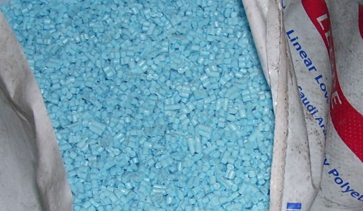

# Part 1: About ABS

## What is ABS?

ABS is a type of thermoplastic. It does not have outstanding performance, but rather offers mostly good characteristics across a broad range.

The name "acrylonitrile butadiene styrene" is an ingredient list, as ABS is made by polymerizing (chemically joining into long chains) these three materials, called *monomers*. Varying the ratio of each component produces slightly different characteristics. For this reason, properties of ABS and other polymers are often given within a range. Other polymers can be added to further tweak the final product's properties.

ABS is noteworthy for being easy and affordable to manufacture. Because it is an amorphous polymer, when heated it can be extruded and molded like glass. It is machinable at room temperature and can be chemically welded with common solvents like acetone. Combining these techniques allows manufacturers multiple ways to fabricate parts with ABS and contributes to the popularity of ABS in manufacturing.

<figure markdown>

<figcaption markdown>
A bag of resin pellets. Source: [SuSanA Secretariat](https://www.flickr.com/people/23116228@N07)
</figcaption>
</figure>

Raw ABS and other thermoplastics are distributed as pellets of plastic *resin* commonly called *nurdles*. Manufacturers melt the resin, optionally adding colorants or other additives to modify the appearance and other properties of the final product.

Once melted, the ABS is formed into shape; for FDM filament manufacturers, this means stretching the material into *filament* (long, thin cylinders of a uniform diameter) and rolling it on to spools.

<figure markdown>

<figcaption markdown>
A spool roll of Orange Prusament filament. Filament is normally available in 1.75mm and 2.85mm diameters. Source: Prusa Research
</figcaption>
</figure>

## Material Categories

For purposes of this article, we will discuss three different categories of 3D-printable plastics.

- Entry-level plastics: 
    - PLA (polylactic acid)
    - PETG (polyethylene terephthalate glycol)
    - TPU (thermoelastic polyurethane)[^a2]
- Engineering plastics:
    - **ABS (acrylonitrile butadiene styrene)**
    - ASA (acrylonitrile budadient acrylate)
    - PA (Nylon, polyamide)
    - PC (polycarbonate)
    - PP (polypropylene)
- High-end plastics: 
    - PTFE (polytetraflouroethylene)
    - PEEK (polyether ether ketone)
    - PEI (Ultem, polyetherimide)
    - PMMA (Acrlic, poly(methyl methacrylate))

This list is for the purposes of discussion only; it is not a standard. Some materials, like PC, qualify as engineering or high-end depending on the formulation used.

### Entry-Level Plastics

Entry-level materials are printable by nearly any off-the-shelf FDM printer[^a4]. They are low cost, easily obtained, printable in open air, and relatively forgiving for novices. Air filtration with these plastics is recommended indoors[^a5] but is not absolutely necessary.

The requirements for printing entry-level plastics are very basic:

1. Nozzle temperatures up to 245°C (473°F);
2. Heated bed temperatures up to 80°C (176°F); and 
3. Air temperatures should be within 15°C (59°F) and 30°C (86°F).

Entry-level plastics have wide melt ranges and not all require a heated bed. 

### Engineering Plastics

Engineering plastics, including ABS, have widespread use in other manufacturing industries. Engineering plastics print at higher temperatures and require more environmental control than entry-level materials:

1. Nozzle temperatures up to 285°C (545°F);
2. Heated bed temperatures up to 110°C (248°F);
3. Air temperatures 40°C (104°F) or higher;
4. Air filtration or venting; and
5. Benefit from uniform air temperature.

Of the list above, #4 and #5 require an enclosure and #3 typically needs one.

Note that the last item, uniform air temperature, is *not* related to using a part cooling fan; instead, it refers to using fans to evenly distribute heat around the print environment. This is largely beneficial when printing larger parts that may otherwise cool unevenly.

The [specific requirements](printing.md#requirements) for printing ABS are on the next page.

### High-End Plastics

Lastly, there are high-end plastics. Materials in this category are often used in manufacturing for aerospace, medical, and other industries. Printing these plastics requires the use of materials that can tolerate extreme temperatures. FDM printing high-end plastics requires a carefully insulated and well-protected build environment.[^a6] These are typically commercial printers or bespoke hobbyist machines.

As a rough cutoff, engineering plastics end and high-end plastics begin when a material requires any one of the the following:

- Nozzle temperatures over 280°C (536°F);
- Heated bed temperature over 120°C (248°F); and/or
- Air temperatures over 60°C (140°F).

This article does not delve into high-end plastics, as they are outside the capabilities of all but the most expensive FDM printers.

## Material Considerations

ABS is widely used in injection molding. Injection molding allows mass production at low per-unit costs with a high up-front cost for the molds and prototype(s).[^b1]

Prototyping ABS parts for injection molding was one of the first commercial uses of FDM 3D printing. 3D printed parts can be nearly as strong as their injection molded equivalents; this allows cheap prototypes before committing to an expensive mold. Under the right conditions, ABS is also easy to 3D print.

Below are some general properties of ABS plastic. We'll get into more detail in the next section about how ABS behaves when printed.

**Pros**

- Thermoplastic (can be heated repeatedly without damage)
- Affordable and easily sourced
- Rigid & impact resistant
- High continuous use temperature
- Can be machined
- Can be painted 
- Can be chemically glued
- Good heat insulator
- Excellent electrical insulator
- Some resins can be sterilized for medical use
- Easily recycled in industrial conditions

**Cons**

- Not UV-stable (degrades in sunlight)
- Fair chemical resistance
- Poor solvent resistance
- Most resins are not food safe
- Combustible under open flame
- Not consumer recycleable

ABS has several properties in the "Pros" list that are useful for manufacturers, particularly how easily it can be shaped and machined. ABS tolerates most everyday temperatures, though food safety and burning when exposed to open flame are both concerns.

Because solvents are a problem, ABS is generally kept away from garages and kitchens.

ABS is not UV-stable and yellows and cracks over time when left in sunlight. A UV-stable and weather-resistant substitute, ASA, is discussed in more detail under [Alternatives](materials.md#alternatives).

Pre-consumer ABS recycling is performed, but ABS recycling is not available to consumers (post-consumer recycling).

[^a2]: TPU is a large family of polymers that are flexible. Most TPU sold as filament has a Shore A hardness of 90-95 and feels like soft rubber. Flexibile filament imposes unique requirements that are outside the scope of this article.

[^a4]: Without significant modification.

[^a5]:
    During the extrusion process, all plastics off-gas VOCs and microparticles of plastic. Some plastics are typically printed in open air, but **lack of unpleasant odor does not equal safety**. An activated carbon/HEPA filter combination in the same room as a 3D printer (preferably near the build area) is considered sufficient for open-air printing, but research is ongoing.

[^a6]: 
    For example, PEI is used to coat 3D printer heated beds, which can reach 125°C or more. Considerations for high-temperature enclosures are discussed in Part 2.

[^b1]: 
    A familiar use of injection-molded ABS is in the manufacture of LEGO bricks.

*[FDM]: Fusion deposition modeling: a method of 3D printing material in layers by extruding heated plastic through a nozzle.
*[HDT]: Heat-deflection temperature: the temperature where a material under a fixed amount of stress begins to bend.
*[VOC]: Volatile organic compounds: these off-gas from many common products and chemicals, including during 3D printing.
*[VOCs]: Volatile organic compounds: these off-gas from many common products and chemicals, including during 3D printing.
*[PLA]: Polylactic acid: a brittle plastic with a low melting point; widely used for 3D printing.
*[PETG]: Polyethylene terephthalate glycol: a clear, slightly flexible polymer widely used for food-safe purposes.
*[TPU]: Thermoelastic polyurethane: a family of highly elastic polymers with a wide range of uses; often compared to rubber in mechanical properties.
*[PA]: Polyamide: a family of polymers that includes Nylon.
*[PC]: Polycarbonate: a family of polymers known for extreme hardness, resistance to heat, and clarity.
*[PTFE]: Polyfluorotetraethylene: also known as Teflon, PTFE tolerates very high temperatures but produces toxic gas when heated enough.
*[PMMA]: Poly(methyl methacrylate): a highly clear, rigid plastic commonly known as acrylic.
*[PEEK]: Polyether ether ketone: a plastic with exceptional mechanical, chemical, and thermal properties that is commonly used in extreme conditions (up to 500C).
*[ASA]: Acrylonitrile styrene acrylate: a UV-stable and more heat-resistant polymer related to ABS.
*[PEI]: Polyetherimide: a plastic similar to PEEK with a higher temperature range and adhesive properties; frequently used on 3D printer beds.
*[PP]: Polypropylene: lightweight material that is microwave- and dishwasher-safe. Commonly found in packing materials and drink bottles.
*[thermoplastic]: Thermoplastics are a class of polymers that can be heated enough to soften, processed into a desired shape, then allowed to cool. These plastics are normally safe to heat and reheat indefinitely without destructive effect, making them easy to recycle, amongst other benefits.
*[off-gas]: Plastics heated sufficiently break down and release gaseous byproducts; this is called off-gassing.
*[polymer]: 
    A polymer is a material made of repeating chains of smaller molecules and can be thousands or millions of links long. Examples of polymers are plastics, DNA, and proteins.
*[Vicat Softening Temperature]: 
    The Vicat softening temperature is used to determine the temperature at which a material can be penetrated 1mm by a fixed amount of pressure.
*[Tensile Strength]: Tensile strength: how far a material can be stretched before breaking
*[Flexural Modulus]: Flexural modulus: the tendency for a material to resist bending, defined by ratio of stress to strain.
*[Young's Modulus]: Young's Modulus: stiffness of a material when force is applied to the long axis
*[delamination]: Delamination: separation of a 3D print's adjacent layers due to material warp. A print with delamination is structurally weak and should be discarded.
*[anneal]: Anneal: To heat a material and allow to cool slowly in order to relieve internal stresses. Annealing plastic often takes hours.
*[annealed]: Anneal: To heat a material and allow to cool slowly in order to relieve internal stresses. Annealing plastic often takes hours.
*[warp]:
    Warp: Warp is deformation of printed plastic from uneven cooling. Warp typically affects parts at the edges and causes "lift" or "curling".
*[resin]: Plastic resin: plastic pellets that are the source material for industrially-made plastics, including filament. They are melted and formed into a desired shape, then allowed to cool.