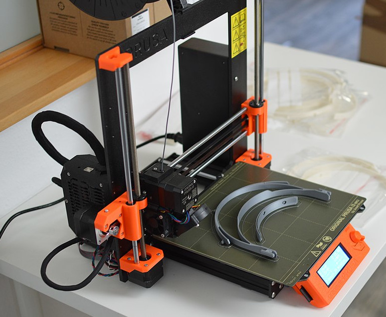

## Overview

The additive manufacturing industry and hobbyists worldwide continue to invent new methods to 3D print materials. [Concrete](https://www.mudbots.com/), [titanium](https://www.protolabs.com/services/3d-printing/direct-metal-laser-sintering/titanium/), [chocolate](https://cocoapress.com/), and [glass](https://nobula3d.com/) are regularly 3D printed, but FDM machines that model thermoplastic remain the most common. Stores sell an entry-level FDM printer for $100[^a1], while commercial FDM printers list for $10,000 or more.

This article is written for individuals in manufacturing or adjacent industries with an idea of what FDM can do but minimal or no hands-on experience. It focuses on a specific 3D-printable material, acrylonitrile butadiene styrene (ABS): 

- The material properties that make it attractive,
- What printing ABS requires, and
- A comparison with 3D-printable thermoplastics.

<figure markdown>

<figcaption markdown>
An FDM 3D printer, manufactured by Prusa. Source: [European Space Agency](https://www.esa.int/ESA_Multimedia/Images/2020/04/3D_printer_EAC#.XqbGVblUaYs.link)
</figcaption>
</figure>

[^a1]: Specifically, the Creality Ender 3 Pro lists for around $100USD. Higher quality entry-level machines can be found for $250-$300.

*[FDM]: Fusion deposition modeling: a method of 3D printing material in layers by extruding heated plastic through a nozzle.
*[HDT]: Heat-deflection temperature: the temperature where a material under a fixed amount of stress begins to bend.
*[VOC]: Volatile organic compounds: these off-gas from many common products and chemicals, including during 3D printing.
*[VOCs]: Volatile organic compounds: these off-gas from many common products and chemicals, including during 3D printing.
*[PLA]: Polylactic acid: a brittle plastic with a low melting point; widely used for 3D printing.
*[PETG]: Polyethylene terephthalate glycol: a clear, slightly flexible polymer widely used for food-safe purposes.
*[TPU]: Thermoelastic polyurethane: a family of highly elastic polymers with a wide range of uses; often compared to rubber in mechanical properties.
*[PA]: Polyamide: a family of polymers that includes Nylon.
*[PC]: Polycarbonate: a family of polymers known for extreme hardness, resistance to heat, and clarity.
*[PTFE]: Polyfluorotetraethylene: also known as Teflon, PTFE tolerates very high temperatures but produces toxic gas when heated enough.
*[PMMA]: Poly(methyl methacrylate): a highly clear, rigid plastic commonly known as acrylic.
*[PEEK]: Polyether ether ketone: a plastic with exceptional mechanical, chemical, and thermal properties that is commonly used in extreme conditions (up to 500C).
*[ASA]: Acrylonitrile styrene acrylate: a UV-stable and more heat-resistant polymer related to ABS.
*[PEI]: Polyetherimide: a plastic similar to PEEK with a higher temperature range and adhesive properties; frequently used on 3D printer beds.
*[PP]: Polypropylene: lightweight material that is microwave- and dishwasher-safe. Commonly found in packing materials and drink bottles.
*[thermoplastic]: Thermoplastics are a class of polymers that can be heated enough to soften, processed into a desired shape, then allowed to cool. These plastics are normally safe to heat and reheat indefinitely without destructive effect, making them easy to recycle, amongst other benefits.
*[off-gas]: Plastics heated sufficiently break down and release gaseous byproducts; this is called off-gassing.
*[polymer]: 
    A polymer is a material made of repeating chains of smaller molecules and can be thousands or millions of links long. Examples of polymers are plastics, DNA, and proteins.
*[Vicat Softening Temperature]: 
    The Vicat softening temperature is used to determine the temperature at which a material can be penetrated 1mm by a fixed amount of pressure.
*[Tensile Strength]: Tensile strength: how far a material can be stretched before breaking
*[Flexural Modulus]: Flexural modulus: the tendency for a material to resist bending, defined by ratio of stress to strain.
*[Young's Modulus]: Young's Modulus: stiffness of a material when force is applied to the long axis
*[delamination]: Delamination: separation of a 3D print's adjacent layers due to material warp. A print with delamination is structurally weak and should be discarded.
*[anneal]: Anneal: To heat a material and allow to cool slowly in order to relieve internal stresses. Annealing plastic often takes hours.
*[annealed]: Anneal: To heat a material and allow to cool slowly in order to relieve internal stresses. Annealing plastic often takes hours.