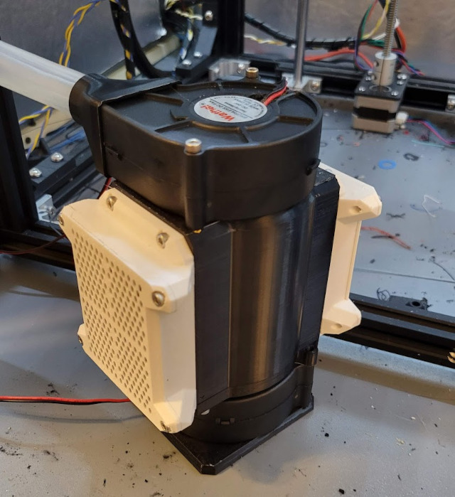

*ABS material properties and considerations in FDM 3D printing, page 2 of 3.*

## Requirements

1. Nozzle temperature: 235°C - 255°C (455°F - 491°F)
2. Heated bed: 90°C - 110°C (194°F - 230°F)
3. Air temperature: 30°C - 75°C (86°F - 167°F)
4. Air filtration is required.
5. Airflow improves print performance under certain conditions.

ABS needs all five of general conditions for printing engineering plastics listed on the [previous page](about.md#engineering-plastics). Nevertheless, it can be surprisingly easy to print once the air temperature is high enough.

Entry-level 3D printers are generally capable of handling the nozzle and bed temperatures required by ABS; the sole exception to this is discussed in the next section. The remaining requirements center around environmental control, and a good enclosure handles all of these.

Note that some modified ABS materials (often called ABS+ or ABS Lite) can be printed at lower nozzle, bed, and air temperatures but also have lower *operating* temperatures. They may not be as performant in some areas, particularly heat tolerance.

### Extruding ABS

<figure markdown>

<figcaption markdown>
A diagram of an E3D V6 all-metal hotend. Source: [Prusa Research](https://help.prusa3d.com/article/extrusion-stopped-mid-print-heat-creep_1948)
</figcaption>
</figure>

FDM 3D printers push plastic filament into a *heater block* hot enough to melt the filament; the liquid plastic is squeezed out through a metal nozzle. The whole of the assembly pictured above is called the *hotend*.

In the image above, a heater cartridge heats the heater block and nozzle. A thermistor senses the temperature and provides feedback to the printer to control the nozzle temperature. A stepper motor (not pictured) pushes filament through the hotend and out of the nozzle.

Not all hotends are designed to print ABS due to an inadequate *heatbreak*. A PTFE tube (pale green above) containing filament passes through the heat sink and ends at the heatbreak. Heatbreaks join the heater block and heat sink; they are designed to transfer as little heat as possible between them. The combination of heat sink and the slow heat transfer of the heatbreak keeps filament well below its melting point until it reaches the heater block.

Low-end hotends pass the PTFE tube through the heatbreak to butt against the nozzle. This limits the nozzle temperature to the maximum safe operating temperature of PTFE (about 235°C), which is generally inadequate for printing ABS. Hotends with a heatbreak that separates the PTFE tube and nozzle are termed *all-metal hotends*.

### Enclosures

An enclosure protects an in-progress 3D print from environmental changes. A cardboard box covering a 3D printer is an enclosure, albeit hazardous and makeshift. Mylar tents are a common and less dangerous option. Quality enclosures are more permanent and made of durable materials[^c2]; they may provide a range of features:

- Environmental control,
- Air filtration or a venting system,
- Lighting,
- A large door or access hatch,
- Sound dampening, and
- (In some cases) active heating.

3D printer enclosures are either integrated to the printer or external. With an external enclosure, an existing printer is installed inside an enclosure that may or may not have been designed for the specific printer. An integrated enclosure is built into the frame of the printer; on some printers this is sold as an optional add-on. Integration makes enclosure smaller and can add rigidity to the printer frame.

=== "External Enclosure"
    <figure markdown>
    {width="400px"}
    <figcaption markdown>
    An enclosure made from IKEA LACK tables. Source: Prusa Research
    </figcaption>
    </figure>
=== "Integrated Enclosure"
    <figure markdown>
    
    <figcaption markdown>
    QIDI Tech printers with integrated enclosures. Source: public domain
    </figcaption>
    </figure>
    

### Filtration and Fire Safety

Temperature control does not have to be built-in to an enclosure, but it should be present for safety. An enclosure sufficient heat production (and insulation) may reach temperature that risk electrical fires. An enclosure should have a method to monitor the air temperature and automatically cools the air or shut down. The most common method of cooling is through an exhaust vent, whether filtered or unfiltered.[^c5]

Some enclosures have active heating elements to reach very high temperatures; these are uncommon outside of high-end commercial printers. For safety reasons, the hobbyist printer design group [VORON Design](https://vorondesign.com/) notably does not allow discussion of active heating methods in their online communities.

Continuous filtration or a venting mechanism is necessary to evacuate or trap styrene and other VOCs given off by ABS. At a minimum, ABS air filtration requires coconut shell (acid-free) activated carbon to remove styrene from the air. The addition of a HEPA filter also removes larger microplastics that may also be hazardous.

<figure markdown>

<figcaption markdown>
An activated carbon and HEPA air filter with dedicated internal filter fan and external exhaust fan. Source: Jon Harper/[SUAFT](https://jon-harper.github.io/air_filter)
</figcaption>
</figure>

## The Part Cooling Myth

<figure markdown>

<figcaption markdown>
The blower at top left directs air through the duct and to a point just underneath the nozzle at center. Source: Jon Harper.
</figcaption>
</figure>

A common myth about ABS is that it should be printed without a part cooling fan. Part cooling fans blow air on the plastic extruded from a 3D printer's nozzle. This "sets" the material by quickly cooling it and helps to prevent sagging other blemishes. Materials like PLA benefit greatly from part cooling fans.

ABS is prone to warp and layer separation when cooled too quickly. A belief developed that part cooling fans cause this; rather, this is a sign that the ambient air temperature is not hot enough. At around 45°C (113°F), ABS behaves much like PLA printed at room temperature and needs a part cooling fan. After the initial cooling blast of air, the enclosure's high air temperature allows the ABS to continue cooling more gradually, preventing warp and delamination.

To resolve issues with entry-level materials, the answer is often "more part cooling". In many cases, issues in ABS printing are solved with a hotter enclosure first, *then* adding more part cooling.

## Bed Adhesion

Heated beds have a *build plate* or *build surface* to keep printed plastic in a slightly amorphous state (like melted glass or putty). Material in this state is slightly pliable and sticky; this helps keep a printed part in place.

A build plate is typically covered with or made from a material designed to stick to plastic. The most common material for this is a thin layer of PEI, and ABS performs well on PEI sheets.

Textured surfaces are used to better bind a print to the build plate than a smooth surface can by giving better "grip". The surface texture increases the plastic's contact area and overall adhesion.

Finally, glue sticks and hairspray are sometimes needed, including with ABS. Adhesives *also* become sticky when heated, so a thin coat of glue stick will keep a printed part in place when hot and release it when cooled. These added adhesives are also popular because they can be reused several times once applied.

## Pros and Cons

We've set the conditions and requirements for printing ABS. What's it like to print and use ABS?

**Pros**

- Easily post-processed by sanding, acetone smoothing, drilling, etc.
- Excellent layer adhesion
- Minimal warp for smaller parts
- Predictable shrinkage

**Cons**

- Prone to warping in uncontrolled/cooler print environments
- Toxic off-gassing from styrene
- Moisture adsorbtion affects print quality
- ABS supports are difficult to remove

As in other manufacturing fields, printed ABS parts can be machined, sanded, drilled and otherwise post-processed as needed. 

ABS adheres to itself *very* well, so parts printed in ABS are hard to separate at the layer lines.[^c3] This has a downside, in that printed supports are difficult to impossible to remove from ABS prints without damaging them.[^c4]

ABS has a low, predictable shrink when allowed to cool gradually; this is an advantage over high-shrink materials like PC that must be annealed after printing to relieve internal stress. Small parts have little difficulty with warping due to uneven cooling, as well.

In imperfect conditions, generally due to too-low bed and air temperatures, ABS behaves very poorly. At room temperature, ABS is nearly impossible to print properly.

A final note on moisture: ABS does not *ab*sorb moisture (take up), it *ad*sorbs it (becomes externally coated in it). This is an issue with ABS printing; moisture-coated filament produces pockets of steam inside the heater block. These pockets exit the nozzle with a distinctive noise and produce imperfections in the resulting print.
    
[^c2]: Materials used to manufacture enclosures vary from metals like steel or aluminum to woods and plastics. Acrylic (PMMA) is commonly used for windows and doors for visibility.

[^c5]: 
    An unfiltered exhaust ducts air outside the building, usually out a window or through the ceiling.

[^c3]: Parts with weak layer adhesion are like flakey pastries and easily split into layers. The flaky dessert Baklava is a good example.

[^c4]:
    Supports are sacrificial material that is added to a 3D print. If a design includes an area with nothing directly underneath, something must keep the hot plastic from falling while it cools. Supports are added to a print (generally automatically by software) to keep the plastic in place.
    
    Supports are broken or cut off after printing; with ABS, the layer adhesions is sufficient to make support removal destructive to the print.

*[FDM]: Fusion deposition modeling: a method of 3D printing material in layers by extruding heated plastic through a nozzle.
*[HDT]: Heat-deflection temperature: the temperature where a material under a fixed amount of stress begins to bend.
*[VOC]: Volatile organic compounds: these off-gas from many common products and chemicals, including during 3D printing.
*[VOCs]: Volatile organic compounds: these off-gas from many common products and chemicals, including during 3D printing.
*[PLA]: Polylactic acid: a brittle plastic with a low melting point; widely used for 3D printing.
*[PETG]: Polyethylene terephthalate glycol: a clear, slightly flexible polymer widely used for food-safe purposes.
*[TPU]: Thermoelastic polyurethane: a family of highly elastic polymers with a wide range of uses; often compared to rubber in mechanical properties.
*[PA]: Polyamide: a family of polymers that includes Nylon.
*[PC]: Polycarbonate: a family of polymers known for extreme hardness, resistance to heat, and clarity.
*[PTFE]: Polyfluorotetraethylene: also known as Teflon, PTFE tolerates very high temperatures but produces toxic gas when heated enough.
*[PMMA]: Poly(methyl methacrylate): a highly clear, rigid plastic commonly known as acrylic.
*[PEEK]: Polyether ether ketone: a plastic with exceptional mechanical, chemical, and thermal properties that is commonly used in extreme conditions (up to 500C).
*[ASA]: Acrylonitrile styrene acrylate: a UV-stable and more heat-resistant polymer related to ABS.
*[PEI]: Polyetherimide: a plastic similar to PEEK with a higher temperature range and adhesive properties; frequently used on 3D printer beds.
*[PP]: Polypropylene: lightweight material that is microwave- and dishwasher-safe. Commonly found in packing materials and drink bottles.
*[thermoplastic]: Thermoplastics are a class of polymers that can be heated enough to soften, processed into a desired shape, then allowed to cool. These plastics are normally safe to heat and reheat indefinitely without destructive effect, making them easy to recycle, amongst other benefits.
*[off-gas]: Plastics heated sufficiently break down and release gaseous byproducts; this is called off-gassing.
*[polymer]: 
    A polymer is a material made of repeating chains of smaller molecules and can be thousands or millions of links long. Examples of polymers are plastics, DNA, and proteins.
*[Vicat Softening Temperature]: 
    The Vicat softening temperature is used to determine the temperature at which a material can be penetrated 1mm by a fixed amount of pressure.
*[Tensile Strength]: Tensile strength: how far a material can be stretched before breaking
*[Flexural Modulus]: Flexural modulus: the tendency for a material to resist bending, defined by ratio of stress to strain.
*[Young's Modulus]: Young's Modulus: stiffness of a material when force is applied to the long axis
*[delamination]: Delamination: separation of a 3D print's adjacent layers due to material warp. A print with delamination is structurally weak and should be discarded.
*[anneal]: Anneal: To heat a material and allow to cool slowly in order to relieve internal stresses. Annealing plastic often takes hours.
*[annealed]: Anneal: To heat a material and allow to cool slowly in order to relieve internal stresses. Annealing plastic often takes hours.