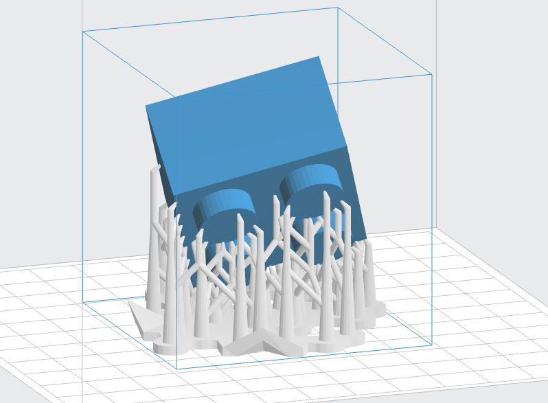
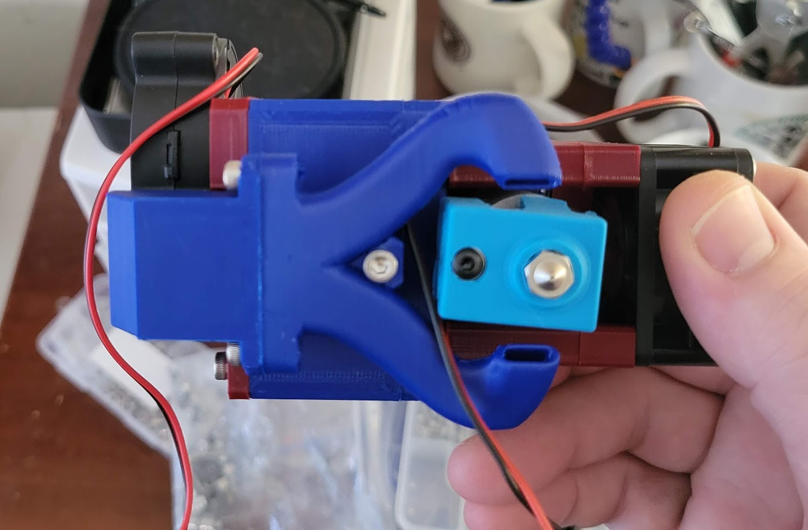

# Part 2: Printing ABS

## Pros and Cons

What's it like to print and use ABS?

**Pros**

- Easily post-processed by sanding, acetone smoothing, drilling, etc.
- Excellent layer adhesion
- Minimal warp with small parts
- Predictable shrinkage

**Cons**

- Prone to warping in uncontrolled/cooler print environments
- Styrene off-gassing requires filtration
- Moisture adsorbtion affects print quality
- ABS supports are difficult to remove

As in other manufacturing fields, printed ABS parts can be machined, sanded, drilled and otherwise post-processed as needed. 

ABS adheres to itself *very* well, so parts printed in ABS are hard to separate at the layer lines.[^c3] This has a downside, in that printed supports are difficult to impossible to remove from ABS prints without damaging them.[^c4]

<figure markdown>

<figcaption markdown>
Supports allow printing "in mid air" but must be removed when the print is complete. ABS is generally not printable with supports.
</figcaption>
</figure>

ABS has a low, predictable shrink when allowed to cool gradually; this is an advantage over high-shrink materials like PC that must be annealed after printing to relieve internal stress. Small ABS parts have little difficulty with warping due to uneven cooling.

In imperfect conditions, generally due to too-low bed and air temperatures, ABS behaves very poorly. At room temperature, ABS is nearly impossible to print properly.

A final note on moisture: ABS does not *ab*sorb moisture (take up), it *ad*sorbs it (becomes coated in it). Regardless of the how it is introduced, water turns to steam in the heat of the 3D printer's nozzle and creates blemishes in the resulting print. As a result, ABS must be stored in low humidity, below 30%.

## Requirements

ABS needs all five of the general conditions for printing engineering plastics listed in [Part 1](about.md#engineering-plastics). Nevertheless, it is fairly forgiving once the air temperature reaches about 45°C (113°F).

ABS prints best under these conditions:

1. Nozzle temperature: 230°C - 250°C (446°F - 482°F)
2. Heated bed: 90°C - 110°C (194°F - 230°F)
3. Air temperature: 35°C - 75°C (95°F - 167°F)
4. Air filtration and an enclosure are required.
5. Air circulation is recommended to ensure an even air temperature.
6. A part cooling fan is usually beneficial.

Entry-level 3D printers are capable of handling the nozzle and bed temperatures required by ABS; the sole exception to this is discussed in the next section. The remaining requirements center around environmental control, and a good enclosure handles all of these.

Some modified ABS materials (often called *ABS+* or *ABS Lite*) can be printed at lower nozzle, bed, and air temperatures but also have lower operating temperatures. They may not be as performant in some areas, such as impact resistance.

### Extruding ABS

<figure markdown>

<figcaption markdown>
A diagram of an E3D V6 all-metal hotend. Source: [Prusa Research](https://help.prusa3d.com/article/extrusion-stopped-mid-print-heat-creep_1948)
</figcaption>
</figure>

The assembly pictured above is called a *hotend*. FDM 3D printers push plastic filament into a *heater block* hot enough to melt the filament; the liquid plastic is extruded (squeezed) through a metal nozzle.

A heater cartridge and thermistor are mounted to the heater block. The thermistor reports the temperature; the printer controls the heater cartridge based on this feedback. A stepper motor (not pictured) pushes filament through the hotend and out of the nozzle. Nozzles vary in diameter from 0.25mm to over 1mm and control how much material is extruded at once. Smaller nozzles print finer details; larger nozzles extrude material faster.

Not all hotends are designed to print ABS due to an inadequate *heatbreak*. A PTFE tube (pale green above) containing filament passes through the heat sink and ends at the heatbreak. Heatbreaks join the heater block and heat sink; they are designed to transfer as little heat as possible between them. The combination of heat sink and the slow heat transfer of the heatbreak keeps filament well below its melting point until it reaches the heater block.

Low-end hotends pass the PTFE tube through the heatbreak to butt against the nozzle. This limits the nozzle temperature to about 235-245°C[^c8], which is generally inadequate for printing ABS. Hotends with a heatbreak that separates the PTFE tube and nozzle are termed *all-metal hotends*.

### Enclosures

An enclosure protects an in-progress 3D print from environmental changes. A cardboard box covering a 3D printer is an enclosure, albeit hazardous and makeshift. Mylar tents are a common and less dangerous option. Quality enclosures are more permanent and made of durable materials[^c2]; they may provide a range of features:

1. Access method(s): 
    - A front door
    - (Occasionally) top or side hatch(es)
2. Environmental control,
3. Air filtration or a venting system,
4. Lighting, and 
5. Sound dampening.

Enclosures use the waste heat from the nozzle and heated bed to warm up. Some enclosures have actively heated chambers; this is discussed more in the next section.

3D printer enclosures are either external or integrated to the printer. An external enclosure may or may not have been designed for the specific printer. An integrated enclosure is built into the frame of the printer; on some printers this is sold as an optional add-on. Integration makes the chamber smaller and can add rigidity to the printer frame.

=== "External Enclosure"
    <figure markdown>
    {width="400px"}
    <figcaption markdown>
    An enclosure made from IKEA LACK tables. Source: Prusa Research
    </figcaption>
    </figure>
=== "Integrated Enclosure"
    <figure markdown>
    
    <figcaption markdown>
    QIDI Tech printers with integrated enclosures. Source: public domain
    </figcaption>
    </figure>
    

### Filtration and Fire Safety

Temperature control does not have to be built in to an enclosure but should be present for safety. An enclosure with sufficient heat production (and insulation) may reach temperatures that risk electrical fires. An enclosure should have the ability to monitor the air temperature and cool the air. The most common method of cooling is through an exhaust vent, whether filtered or unfiltered.[^c5]

Some enclosures have active heating elements[^c1] to reach extreme temperatures; these are uncommon outside of high-end commercial printers.[^c7] For safety reasons, the hobbyist printer design group [VORON Design](https://vorondesign.com/) notably does not allow discussion of actively heated chambers in their online communities.

Continuous filtration or a venting mechanism is necessary to remove styrene and other VOCs given off by ABS. At a minimum, ABS air filtration requires coconut shell (acid-free)[^c6] activated carbon to remove styrene from the air. Adding a HEPA filter removes larger microplastics that may also be hazardous.

<figure markdown>

<figcaption markdown>
An activated carbon and HEPA air filter with two fans: 1) dedicated internal filter fan (bottom) and 2) exhaust fan (top).  Source: Jon Harper/[SUAFT](https://jon-harper.github.io/air_filter)
</figcaption>
</figure>

## Common Issues

We've set the conditions and requirements for printing ABS. What else will help when printing ABS?

### Bed Adhesion

Heated beds are topped with a *build plate* or *build surface*. This build plate is heated to keep the bottom of a printed part pliable and sticky; this helps to keep the part adhered to the plate. A build plate is typically covered with, or made from, a material designed to stick to plastic. The most common material for this is a thin layer of PEI, and ABS performs well on PEI sheets.

A standard build plate is as smooth as possible. Textured build plates are often used with ABS to increase the plastic's contact area with the plate.

<figure markdown>
{width="480px"}
<figcaption markdown>
Glue sticks are a common adhesion aid and releasing agent.
</figcaption>
</figure>

Glue sticks and hairspray are sometimes needed, including with ABS. Adhesives become sticky when heated; a thin coat of glue stick will keep a printed part in place when hot and release it after cooling down. A light coat of glue stick can be reused several times without needing reapplication.

A printed solution for adhesion is called a *brim*. A brim is extra material that surrounds the first layer of a print, usually by tracing the outline of the part in widening tracks. This gives the adhesion of a much larger part but must be removed from the finished print.

### The Part Cooling Myth

<figure markdown>

<figcaption markdown>
The blower at top left directs air through the duct and to a point just underneath the nozzle at center-right. Source: Jon Harper.
</figcaption>
</figure>

Part cooling fans blow air on filament as it exits the nozzle. This quickly cools the material, "setting" it to prevent sagging and other blemishes. Materials like PLA benefit greatly from part cooling fans.

A common myth is that ABS should be printed without a part cooling fan. ABS is prone to warp and delamination when cooled too quickly, and a belief developed that part cooling fans directly cause this. Warp is generally caused by inadequate bed adhesion, and delamination is a sign that the air temperature is not high enough.

When the air is at least 45°C (113°F), ABS behaves much like PLA printed at room temperature and needs a part cooling fan. After the initial cooling blast of air, the enclosure's high air temperature allows the ABS to continue cooling gradually.

To resolve issues with entry-level materials, the answer is often "more part cooling". In many cases, issues in ABS printing are solved with a hotter enclosure before adding more part cooling.

[^c3]: Parts with weak layer adhesion are like flakey pastries and easily split into layers. The flaky dessert Baklava is a good example.

[^c4]:
    Supports are sacrificial material that is added to a 3D print. If a design includes an area with nothing directly underneath, something must keep the hot plastic from falling while it cools. Supports are added to a print (generally automatically by software) to keep the plastic in place.
    
    Supports are broken or cut off after printing; with ABS, the layer adhesion is sufficient to make support removal destructive to the print.

[^c8]: 
    PTFE's operating temperature ranges from 250°C to 260°C, but the material may begin to off-gas at slightly lower temperatures. Additionally, thermistors are less accurate at higher temperatures. There is not an agreed safe margin, but values ranging from 235-245°C are most commonly used.

[^c2]: Materials used to manufacture enclosures vary from metals like steel or aluminum to woods and plastics. Acrylic (PMMA) is commonly used for windows and doors for visibility.

[^c5]: 
    An unfiltered exhaust vents air outside the building through a duct, usually out a window or through the ceiling.

[^c1]: Often using a positive-temperature coefficient (PTC) heater. 

[^c7]: The [3DXTECH GearBox HT2](https://www.3dxtech.com/3d-printer-gearbox/) advertises 250°C air temperatures.

[^c6]: Using activated carbon containing acid causes metal to oxidise (i.e., rust).

*[FDM]: Fusion deposition modeling: a method of 3D printing material in layers by extruding heated plastic through a nozzle.
*[HDT]: Heat-deflection temperature: the temperature where a material under a fixed amount of stress begins to bend.
*[VOC]: Volatile organic compounds: these off-gas from many common products and chemicals, including during 3D printing.
*[VOCs]: Volatile organic compounds: these off-gas from many common products and chemicals, including during 3D printing.
*[PLA]: Polylactic acid: a brittle plastic with a low melting point; widely used for 3D printing.
*[PETG]: Polyethylene terephthalate glycol: a clear, slightly flexible polymer widely used for food-safe purposes.
*[TPU]: Thermoelastic polyurethane: a family of highly elastic polymers with a wide range of uses; often compared to rubber in mechanical properties.
*[PA]: Polyamide: a family of polymers that includes Nylon.
*[PC]: Polycarbonate: a family of polymers known for extreme hardness, resistance to heat, and clarity.
*[PTFE]: Polyfluorotetraethylene: also known as Teflon, PTFE tolerates very high temperatures but produces toxic gas when heated enough.
*[PMMA]: Poly(methyl methacrylate): a highly clear, rigid plastic commonly known as acrylic.
*[PEEK]: Polyether ether ketone: a plastic with exceptional mechanical, chemical, and thermal properties that is commonly used in extreme conditions (up to 500C).
*[ASA]: Acrylonitrile styrene acrylate: a UV-stable and more heat-resistant polymer related to ABS.
*[PEI]: Polyetherimide: a plastic similar to PEEK with a higher temperature range and adhesive properties; frequently used on 3D printer beds.
*[PP]: Polypropylene: lightweight material that is microwave- and dishwasher-safe. Commonly found in packing materials and drink bottles.
*[thermoplastic]: Thermoplastics are a class of polymers that can be heated enough to soften, processed into a desired shape, then allowed to cool. These plastics are normally safe to heat and reheat indefinitely without destructive effect, making them easy to recycle, amongst other benefits.
*[off-gas]: Plastics heated sufficiently break down and release gaseous byproducts; this is called off-gassing.
*[polymer]: 
    A polymer is a material made of repeating chains of smaller molecules and can be thousands or millions of links long. Examples of polymers are plastics, DNA, and proteins.
*[Vicat Softening Temperature]: 
    The Vicat softening temperature is used to determine the temperature at which a material can be penetrated 1mm by a fixed amount of pressure.
*[Tensile Strength]: Tensile strength: how far a material can be stretched before breaking
*[Flexural Modulus]: Flexural modulus: the tendency for a material to resist bending, defined by ratio of stress to strain.
*[Young's Modulus]: Young's Modulus: stiffness of a material when force is applied to the long axis
*[delamination]: Delamination: separation of a 3D print's adjacent layers due to material warp. A print with delamination is structurally weak and should be discarded.
*[anneal]: Anneal: To heat a material and allow to cool slowly in order to relieve internal stresses. Annealing plastic often takes hours.
*[annealed]: Anneal: To heat a material and allow to cool slowly in order to relieve internal stresses. Annealing plastic often takes hours.
*[warp]:
    Warp: Warp is deformation of printed plastic from uneven cooling. Warp typically affects parts at the edges and causes "lift" or "curling".
*[resin]: Plastic resin: plastic pellets that are the source material for industrially-made plastics, including filament. They are melted and formed into a desired shape, then allowed to cool.