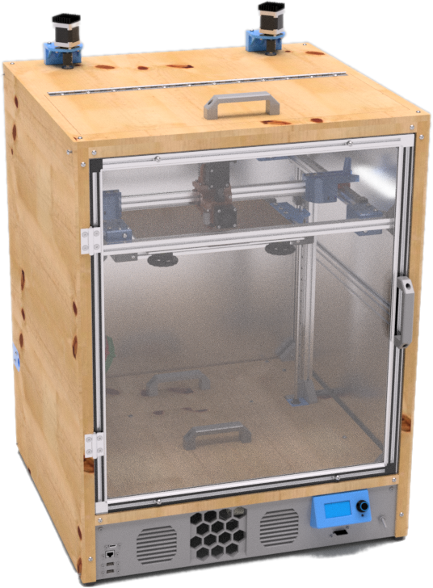

Hello. My name is Jon Harper. My online handle is generally [jonspaceharper](contact.md).

This site a central place to post or link to my various projects and articles.

## About Me

I'm an IT-oriented problem solver. Things I love:

- writing to document and educate;
- teaching and discussing ideas and concepts;
- designing 3D printable, practical solutions;
- developing in C++ and reading about the nuances of the language;
- scripting in Python to simplify tasks;
- the "ah-ha!" of understanding and sharing that feeling with others.

You can find out more on my [about page](about.md). My [contact page](contact.md) also has links to my [LinkedIn bio](https://www.linkedin.com/in/jonspaceharper/) and other professional social media accounts.

## Projects

I actively maintain several projects.

    

        <a href="projects/omnibox/">
            

                

                    
                

                

                
 
                    OmniBox
                

                

                    A modular, 3D-printable electronics case for 3D printers.
                

                

            

        </a>
    

    

        <a href="projects/clock3/">
            

                

                    
                

                

                
 
                    Clock 3
                

                

                    A prototype enclosed 3D printer used as a testbed for new ideas.
                

                

            

        </a>
    

    

        <a href="projects/clock3/">
            

                

                    
                

                

                
 
                    The Clockmaker Project
                

                

                    Tools and guides for enclosed 3D printing.
                

                

            

        </a>
    

You can find other projects on my [GitHub]("https://github.com/jon-harper?tab=repositories") and [Thingiverse](https://www.thingiverse.com/jonspaceharper/designs) profiles.

<!--## Articles

I occasionally put thoughts down about 3D printing, where it is heading, and my projects. You can find the list of articles on the menu to the left, or [follow me on LinkedIn](https://twitter.com/jonspaceharper) for more.

For shorter, rough drafts, follow my [Twitter account](https://twitter.com/jonspaceharper).-->