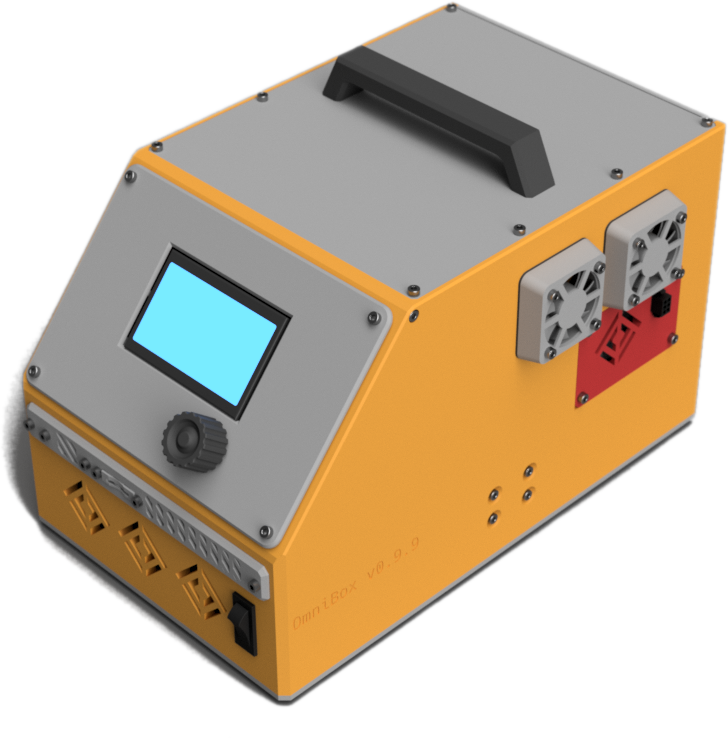

{ data-title="I Kinda Look Like This" data-description="Sorta." width="250px" align="right" }

I'm a technology- and information-oriented problem solver. I love to:

- **write** to document and educate;
- **teach** and discuss ideas and concepts;
- **design** 3D printable, practical solutions;
- **develop** in C++ and learn the nuances of the language;
- **script** in Python to simplify tasks; and
- **learn** new technologies and ideas.

You can find out more in my [resume](resume.md).

## Projects

These are some of the larger projects that I currently develop & maintain.

## [OmniBox](https://jon-harper.github.io/OmniBox)

A modular, 3D-printable electronics case for 3D printers.

[{width="250px"}](https://jon-harper.github.io/OmniBox)

[{width="250px"}](https://jon-harper.github.io/E34M1)

## [E34M1](https://jon-harper.github.io/E34M1)

The EVA 3 toolhead adapted for ZeroG Mercury One 3D printers.

## Public Profiles and Other Works

[:material-github: GitHub](https://github.com/jon-harper/)

[:material-stack-overflow: Stack Overflow](https://stackoverflow.com/users/4732082/jonspaceharper)

[Printables.com](https://www.printables.com/social/511131-jonspaceharper/about)

## Contact

[:material-linkedin: LinkedIn](https://linkedin.com/in/jonspaceharper)

[:material-email: E-mail](mailto:jonspaceharper@@@gmail)

