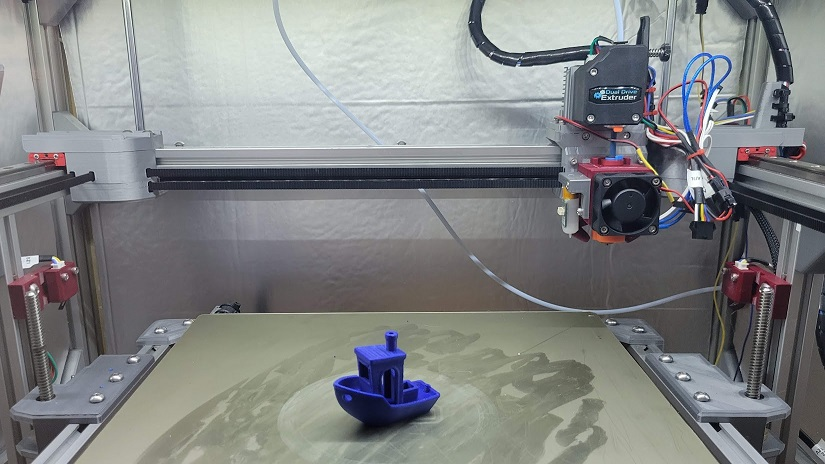
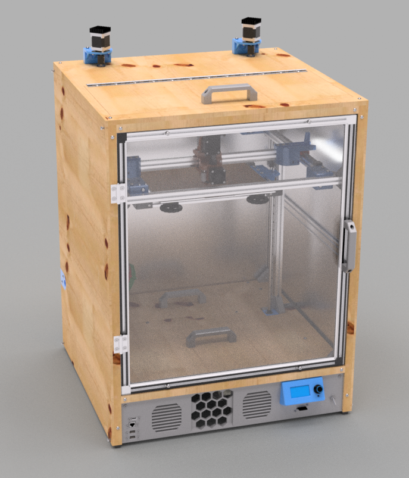
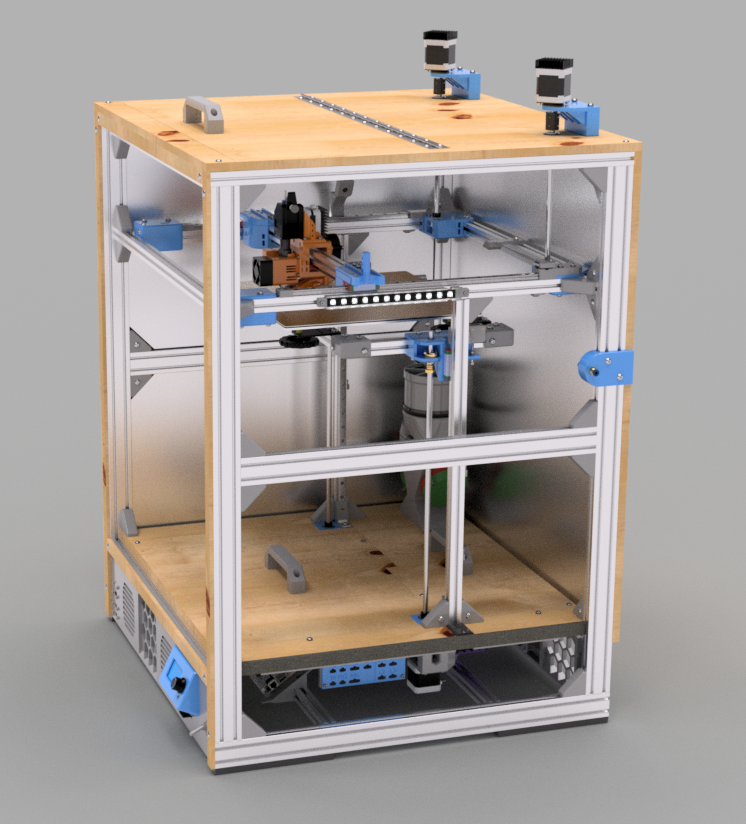
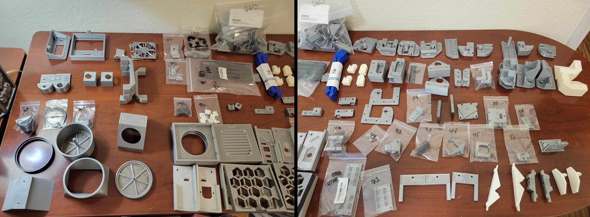

{ data-title="Clock 3 and an ABS Benchy" data-description="A Benchy printed in ABS plastic during Winter, 2021. This milestone demonstrated working kinematics, insulation, and air filtration"}

Clock 3 is a prototype enclosed, CoreXY 3D printer. It is now used to generate new ideas for The Clockmaker Project.

## Goals

<!-- {width="300px"}

{width="300px"} -->

Clock 3 achieved several [development goals](https://jon-harper.github.io/clock-3/about/goals/):

- Ease of Sourcing
- Ease of Servicing
- Flexibility, Safety, and Stability

## Status

Fusion 360 data corruption halted immediate further work, but directly led to the development of [OmniBox][omnibox] and [The Clockmaker Project][clockmaker].

{ width="640px" data-title="Over 100 Unique Printed Parts" data-description="Nearly all of these parts were designed between September of 2021 and May of 2022" }

## Features

Project Features:

- More than 100 unique printed parts;
- Integrated design for HEPA and activated charcoal filtration;
- Python-scripted Bill of Materials generation; and
- Extensive wiring documentation and planning.

Printer Features:

- CoreXY kinematics;
- Large print volume;
- Double-paned enclosure window;
- Top service hatch;
- Floor service hatches; and
- Externally-mounted stepper motors.

Other Features:

- Step-by-step assembly guide;
- Thoroughly documented development;
- Daily changelog; and
- Git-based Klipper configuration.

## Links

[cards lightbox=false cols=3(docs/assets/clock3_links.yml)]

Additional tools from this project:

- [:material-git: clock-face](https://github.com/jon-harper/clock-face): a modified Klipper display to show enclosure temperature
- [:material-git: clock3-klipper](https://github.com/jon-harper/clock3-klipper): Klipper configuration delegation via git
- [:material-git: Clock3Scripts](https://github.com/jon-harper/Clock3Scripts): Fusion 360 Python plugin for automatical bill of materials generation

## Gallery

[cards lightbox=true cols=2(docs/assets/clock3_gallery.yml)]

[omnibox]: omnibox.md
[clockmaker]: clockmaker.md