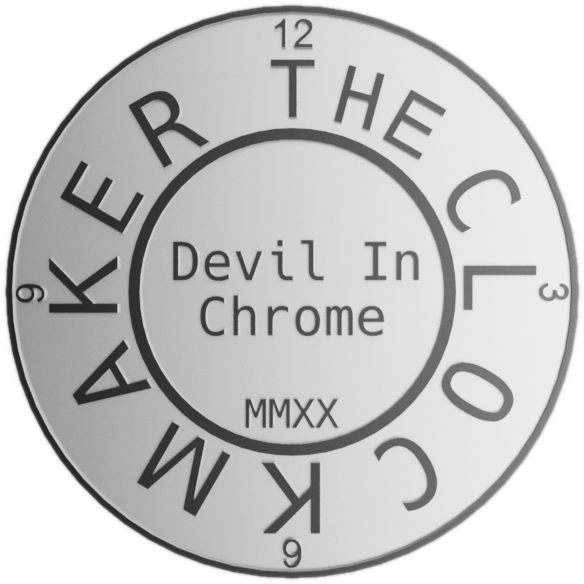



{width="250" align=right}

The Clockmaker Project is a repository of tools and guides for enclosed 3D printing.

## Goals

- Share tools for building and using enclosures;
- Adapt Clock 3's filtration for general use;
- Consolidate other Clock 3 features in one place; and
- Document tools for wire harness fabrication.

## Status

This project is still in initial stages. Content is added as it is completed but may still need revision and editing for accuracy and content.

## Links

{{ cards.start_grid(3) }}
{{ cards.add_card(title="Project Page", content="", image="../../img/clockmaker.png", url="https://jon-harper.github.io/clockmaker-project") }}
{{ cards.add_card(title="GitHub Repository", content="", image="../../img/github.png", url="https://github.com/jon-harper/clockmaker-project") }}
{{ cards.end_grid() }}