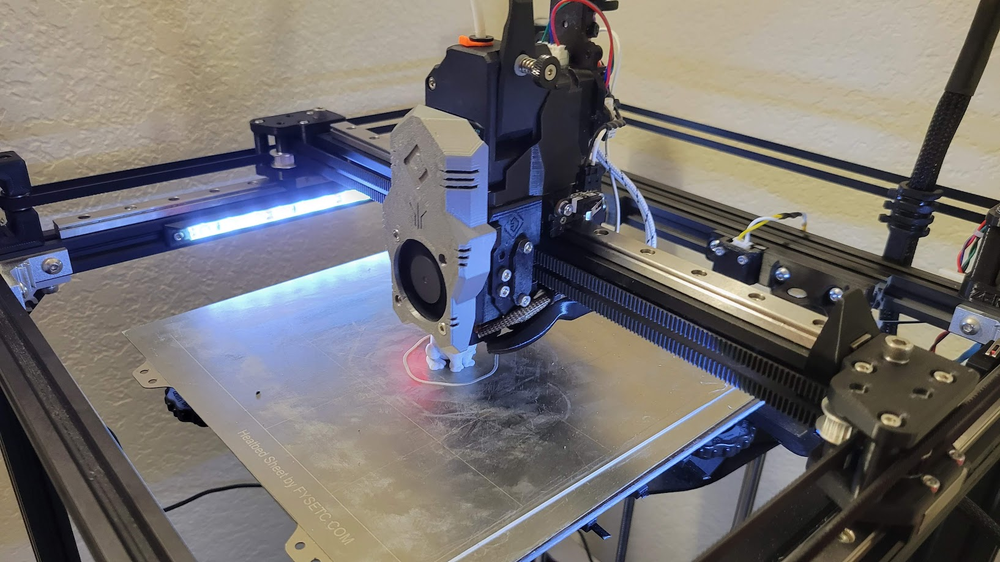

{ data-title="E34M1 Printing" data-description="An Ender 5 Pro converted to Mercury One with the E34M1 modified EVA toolhead."}

This is a project to adapt the [EVA 3](https://main.eva-3d.page/) toolhead for the [ZeroG Mercury One](https://docs.zerog.one/) project.

E34M1 is an abbreviation of "EVA 3 for Mercury One".

## Goals

- Maintain general compatibility with EVA 3, particularly hotends and extruders.
- Make EVA 3 functional on Mercury One with the maximum build area of 275mm x 275mm available.
- Add support for stepper mounted breakout boards.
- Switch to Mercury One heat set inserts to simplify the Bill of Materials.

## Status

E34M1 is released and in general use.

## Links

[E34M1 Documentation](https://jon-harper.github.io/E34M1/)

[E34M1 Printables Page](https://www.printables.com/model/386043-e34m1-eva-3-for-mercury-one)

[GitHub Repository](https://github.com/jon-harper/MercuryOneUserMods)

[EVA](https://main.eva-3d.page/)

[ZeroG Design](https://docs.zerog.one/)

