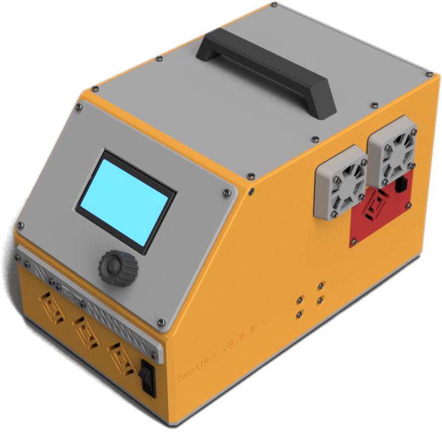

{ align="right" width="300px" data-title="OmniBox v0.9.9" data-description="This is a render of a common OmniBox build configuration."}

This project is a modular, 3D-printable electronics case for 3D printers.

## Goals

OmniBox focuses on reusability, ease of service, and exceptional documentation. It aims to make the electronics case for your 3D printer as valuable and reusable an asset as the printer itself.

## Features

- Broad support for common hardware;
- Continuity and compatibility between releases (to be standardized with version 1.0);
- Rich, clear documentation:
    - Accessible format;
    - Versioned documentation;
    - Bill of materials that accomodates all configurations; and
    - Illustrated assembly guide with video demonstrations.
- Fusion 360 framework:
    - All parts are tagged with internal part numbers;
    - Bill of Material generation is partially automated through Python scripts;
    - Assembly is documented in the model;
    - Documentation illustrations and videos are generated by Fusion; and
    - Core model and many assemblies are textured for realistic promotional renders.

## Status

As of December 2022, OmniBox is on its sixth public release, v0.9.9. It is stable enough for everday use but remains under active development.

## Links


{{ cards.start_grid(3) }}
{{ cards.add_card(title="Project Page & Documentation", content="", image="../../img/omnibox_logo.png", url="https://jon-harper.github.io/OmniBox") }}
{{ cards.add_card(title="GitHub Repository", content="", image="../../img/github.png", url="https://github.com/jon-harper/OmniBox") }}
{{ cards.add_card(title="Twitter @TheOmniBox", content="", image="../../img/twitter.png", url="https://twitter.com/TheOmniBox") }}
{{ cards.end_grid() }}

## Gallery

{{ cards.start_grid(2) }}
{{ cards.add_image(title="Version 0.9.9 Render", image="../../img/omnibox/render1.png", content="Render of an OmniBox next to an Ender 5. Rendered in Fusion 360.") }}
{{ cards.add_image(title="Version 0.9.9 Render", image="../../img/omnibox/render2.png", content="Render of an OmniBox with a spool holder lid next to a mirror. Rendered in Fusion 360.") }}
{{ cards.add_image(title="Early Render", image="../../img/omnibox/render3.png", content="Early render of version 0.9, the initial release.") }}
{{ cards.add_image(title="First Complete OmniBox", image="../../img/omnibox/bigbird1.jpg", content="Photo of the first finished OmniBox, looking slightly disheveled.") }}
{{ cards.add_image(title="Assembly Illustrations", image="../../img/omnibox/illustration1.png", content="Each OmniBox release has had full assembly photos. Version 0.9.9 is the first to use illustrations generated in Fusion 360. This significantly sped up development." ) }}
{{ cards.add_image(title="Micro Fit 3 Connectors", image="../../img/omnibox/panel_mounts.jpg", content="The documentation to design the wiring harnesses that attach to these panels is part of The Clockmaker Project.") }}
{{ cards.add_image(title="TPU Gaskets", image="../../img/omnibox/gasket.jpg", content="TPU (thermoplastic polyurethane) gaskets are an optional addition for fans to reduce noise.") }}
{{ cards.add_image(title="Zip Tie Anchors", image="../../img/omnibox/wiring.jpg", content="The latest release includes plenty of zip tie anchors to manage wiring.") }}
{{ cards.add_image(title="Version 0.9.8.1 Build", image="../../img/omnibox/build2.jpg", content="This 0.9.8.1 case is the first case completed build submitted by a user.") }}
{{ cards.add_image(title="Version 0.9.9 Build", image="../../img/omnibox/build1.jpg", content="OmniBox is still an evolving project, but it is already in general use.") }}
{{ cards.end_grid() }}

[clock3]: clock3.md
[clockmaker]: clockmaker.md