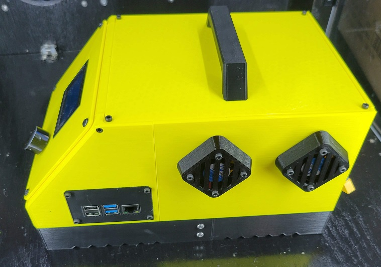

OmniBox is a modular electronics case for 3D printers. It is derived from Steve Burcham's [similar project](https://www.thingiverse.com/thing:3999751).

## Goals

OmniBox keeps the original footprint of Steve's cases with a more accessible, open layout. This layout leaves space for large boards, particularly BIGTREETECH's Octopus. Additionally, the OmniBox base is approximately 1.2" (30mm) shorter in overall height.

A major goal of this project is to standardize my printers with entirely panel mounted connections for external wiring. Using common pinouts for each connector on the panel, two OmniBox cases can be made interchangeable on the hardware level. 

Standardizing these connectors and their pin order is part of [The Clockmaker Project](clockmaker.md).

## Details

- [Project Page and Documentation]("https://jon-harper.github.io/OmniBox")
- [GitHub](https://github.com/jon-harper/OmniBox)
- [Thingiverse Page](https://www.thingiverse.com/thing:5390773)