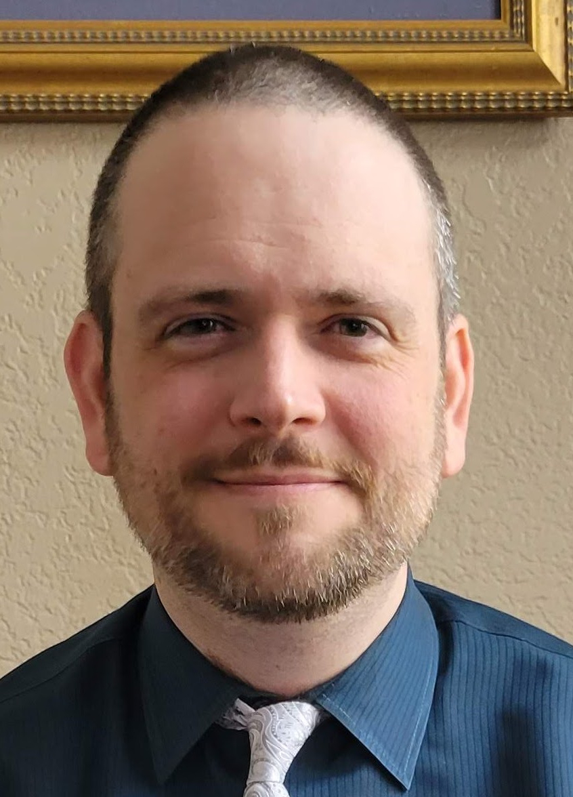

# Resume: Jonathan (Jon) Harper

### Links

{class="jh-photo skip-lightbox"}

[:material-linkedin: LinkedIn](https://linkedin.com/in/jonspaceharper)

[:material-email: E-mail](mailto:jonspaceharper@gmail.com)
<!-- 
[:material-download: PDF Resume](assets/Resume_Jonathan_Harper.pdf) -->

### Qualifications

- Experienced IT professional and business writer with CAD and software development background.
- Excels at explaining concepts, translating technical language, and writing to the audience.
- Actively seeks new solutions and new technologies to learn.
- Broad technical skill base, including:
    - Page layout/desktop publishing (Microsoft Word, Excel, PowerPoint, Adobe Acrobat, Markdown, CSS);
    - Graphic design (Adobe Photoshop & Illustrator, GIMP);
    - Content versioning (git, SharePoint);
    - Software development (C++, Python);
    - Documentation (Doxygen, mkdocs); and
    - Rapid prototyping & CAD (FDM 3D printing, Fusion 360).

## Portfolio of Work

### Projects

[:material-github: GitHub Profile](https://github.com/jon-harper)

Notable Projects:

- **[OmniBox](https://jon-harper.github.io/OmniBox)**: 3D printer electronics case; documentation includes written, illustrated, and video assembly instructions.
- **[E34M1](https://jon-harper.github.io/E34M1/)**: modified toolhead for ZeroG 3D printers; also provides multimedia assembly instructions.
- **[SUAFT](https://jon-harper.github.io/air_filter)**: activated carbon & HEPA filter for enclosed printers; documentation is simple and concise.

### Stack Overflow

Profile: [:material-stack-overflow: jonspaceharper](https://stackoverflow.com/users/4732082/jonspaceharper)

- \>4000 reputation
- Primary topics: C++, Python, Qt, PyQt

Sample Contributions:

- Question: ["Replacing constants: when to use static constexpr and inline constexpr?"](https://stackoverflow.com/questions/54466591/replacing-constants-when-to-use-static-constexpr-and-inline-constexpr)
- Question/Answer: ["What is the purpose of operator RestrictedBool in QScopedPointer?"](https://stackoverflow.com/questions/37012710/what-is-the-purpose-of-operator-restrictedbool-in-qscopedpointer)
- Answer: ["Difference between QPushButton and QToolButton"](https://stackoverflow.com/questions/38576380/difference-between-qpushbutton-and-qtoolbutton/38580502)
- Answer: ["How to create grid style QListWidget?"](https://stackoverflow.com/questions/37331270/how-to-create-grid-style-qlistwidget)
- Answer: ["PyQt: is there an better way to set objectName in code?"](https://stackoverflow.com/questions/50726510/pyqt-is-there-an-better-way-to-set-objectname-in-code)
- Answer: ["What is the asterisk for in signal and slot connections?"](https://stackoverflow.com/questions/38456924/what-is-the-asterisk-for-in-signal-and-slot-connections/38457771)

## Experience

### Career History

**Career Development** (December 2021 - 2024)

- Pivoted to technical writing; prepared a cross-discipline portfolio of works.
- Developed and documented several end-to-end [projects](#projects).
- Co-authored and edited the [Mercury One.1 documentation](https://docs.zerog.one/assets/mercury_one_1_instruction_18-02-2024.pdf).

------
**Top Shelf Solutions** (2002 - 2021)

*Assistant Operations Manager (2012-2016)*

- Designed templates within client branding guidelines.
- Proofread & edited internal & external materials for style, content, and branding comformity.
- Closely followed client technologies and current IT trends.
- Composed and edited SVP & C-level executive biographies, presentations, and other client meeting materials.
- Provided quality control and assisted in preparation and shipping.

*IT Manager (2003-2021)*

- Oversaw the  lifecycle of a small (5-8 seat) business network.
- Assisted with client IT needs:
    - Migrated client (The Harvard Group) to Office 365 and SharePoint in 2011-2012.
    - Transitioned phone and video conferencing IT services to lower overhead and add new capabilities.
    - Documented each transition process, including installation and how-to guides.
    - Provided phone and email support to remote users and investigated network and software issues.
- Provided operations support as-needed for a small business.

------

**Starbucks Coffee** (2005 - 2012, 2016 - 2021)

*Barista* & *Shift Supervisor*

In addition to the duties of a Barista:

- In 2006, headed a maintenance & cleanliness team for a new Store Manager.
    - Labeled and organized all back-of-house inventory.
    - Ensured all equipment regularly calibrated and cleaned; instructed others in care.
- From 2005-2010, managed weekly store bulk order and overall inventory under two (2) store managers:
    - Used spreadsheets to track 3- and 6-week rolling averages.
    - Lowered controllable costs and excess inventory; cut order placement time by half.
    - Nearly eliminated controllable product shortages.
- In 2007-2008, assisted Watters & 121 store opening:
    - Trained new staff in mid-to-late 2017.
    - Ordered and ensured arrival of base supplies and inventory for store opening.
    - Planned and implemented both front- and back-of-house storage layout.
- Served as a trainer from 2006 on, training over two dozen new hires.

------

**Souper! Salad!/Grandy's** (2005 - 2010)

Contracted by San Antonio-based IT department as a first-call technician for DFW area:

- Cut response time significantly and saved overnight trips by department staff.
- Able to take calls normally handled by corporate staff due to familiarity with legacy Radiant Systems platform.
- Assisted in migrating multiple sites from dialup to DSL; later assisted in migration to EVDO-based wireless service.
- After Grandy's acquisition in 2008, assisted in transitioning several restaurants to Radiant Systems and wireless internet service.

------

**Souper! Salad!** (2003 - 2005)

*Assistant Manager* (2004 - 2005) / *Shift Supervisor* (2004) / *Waiter* (2003 - 2004)

In addition to normal management and wait staff duties:

- Acted as lead trainer for training pilot program and prepared Executive Summary for Board presentation.
- Assisted in cutting food costs by 5% of gross sales while responsible for daily inventory orders.
- Consolidated multiple sales and ordering tracking spreadsheets for District Manager.
- Tasked with designing a consolidated maintenance spreadsheet for Dallas and Fort Worth districts.
- Derivative spreadsheets were later rolled out company-wide.

### Education

**The University of Texas at Dallas** (2000 - 2002)